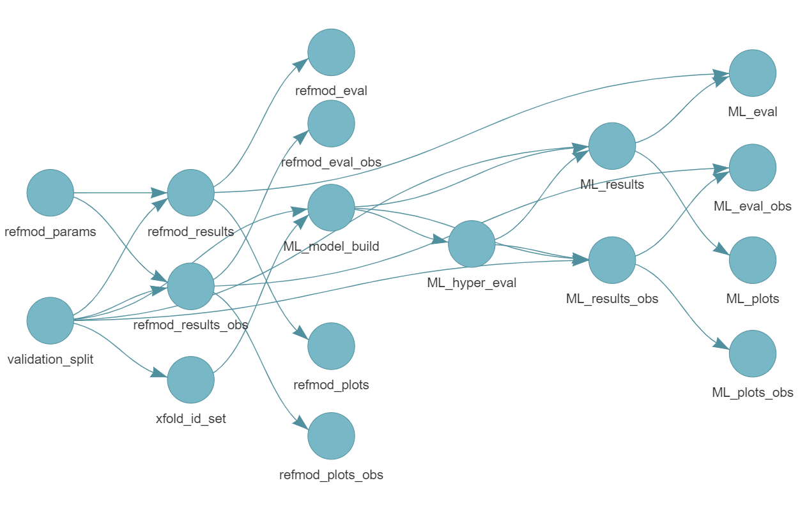
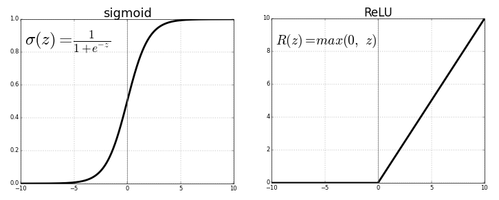

```{r setup, include=FALSE}

R.utils::sourceDirectory("./R/", modifiedOnly = FALSE)

suppressPackageStartupMessages({
  library(shiny)
  library(knitr)
  library(kableExtra)
  library(ggplot2)
})

options(knitr.kable.NA = '')
opts_chunk$set(tidy = FALSE)

boot_dat <- readRDS("boot_data.rds")
boot_ref <- readRDS("boot_ref.rds")
comp_table <- readRDS("boot_compare_wobs.rds")  #Use boot_compare.rds if you don't want to combine observations

dir.base <- "E:/UAB SOPH/Dissertation/Full Project - Meta Database/"
eval_true <- readRDS(paste0(dir.base, "RandEff Impute/impute_true.rds"))
eval_synth <- readRDS(paste0(dir.base, "RandEff Impute/impute_synth.rds"))

data_curr_orig <- readRDS(paste0(dir.base, "MERF/_targets/objects/holdout_split_dat"))
dat <- data_curr_orig$all
dat_bl <- data_curr_orig$bl

```


```{r xaringan-scribble, echo=FALSE}
xaringanExtra::use_scribble()
```

```{r xaringan-tile-view, echo=FALSE}
xaringanExtra::use_tile_view()
```

```{r broadcast, echo=FALSE}
xaringanExtra::use_broadcast()
```


## Outline
.large[
- Overview, objectives and aims

- Approach and design

- Ensemble tree methods

- Sequential neural networks

- Trajectories, forecasting, and imputation

- Final thoughts

]

---

## Overview - Inference/Prediction


As a field, the goal of statistics is to learn from our data, commonly using inference and prediction; although intrinsically related there are subtle differences in how these methods are leveraged


.pull-left[
.large[Inference]

- Use the model to learn about the data generation process

- Explain the relationship between a response and covariates

- Frequently emphasizes unbiased interpretation of this relationship

- Is often the standard approach for biostatisticians

]


.pull-right[

.large[Prediction]

- Use the model to determine likely outcomes from the data

- Role of covariates is to aid in calculating a response

- Emphasis on generalization to unseen data 

- Largely the purview of machine/statistical learning (ML/SL)

]

---

## Overview - Machine Learning

As computational power and data management capacity have increased, machine learning has found greater popularity across a range of applications in a number of different fields such as finance, transportation and medicine

.pull-left[

- Image processing

- Identification / Classification

- Intelligent agents

- Natural language processing

- Text mining

- Decision support

]


.pull-right[

```{r out.width="85%", out.height="85%", echo=F, out.extra='style="margin-left: auto; margin-right:auto; display: block"'}
knitr::include_graphics("Images/ML_App.png")
```

]


One area attempting to utilize its extensive neuroimaging, genetic, biomarker, and clinical/demographic profiling for ML is Alzheimer's disease (AD) and its related dementias

.footnote[https://www.quora.com/What-are-some-real-world-examples-of-applications-of-machine-learning-in-the-field]

---


layout: false

<h2 style="margin-bottom: 10px;">Overview - Alzheimer's Disease</h2>

.pull-left[

```{r echo=F, out.extra='style="margin-left: auto; margin-right:auto; display: block"'}
knitr::include_graphics("Images/AD_data_AL.png")
```

]

.pull-right[

With the ever-aging population, AD has become an increasingly prominent medical concern at the global, national and local level

Accompanying cost and pervasiveness is a recognition to better identify at risk patients who could benefit from preventative measures

This includes both actual measures of ability across the spectrum of cognitive domains or predicting impairment

Prediction is key as the pathological and biological hallmarks of AD precede cognitive disability substantially

]


<p style="padding-top: 10px; text-align: center;">This makes AD ideal for machine learning applications</p>

.footnote[https://alz.org/alzheimers-dementia/facts-figures]

---


## Overview - ML/SL and AD

Recognition of the potential of ML/SL in AD is clear; a PubMed search of "machine learning" and "Alzheimer's disease" returned 1355 results with 330 in 2020 alone while arxiv.org cited another 230+ articles.  However, substantial limitations remain:

 - Models focus on clinical diagnosis as a classification response with little effort to predict neuropyschological outcomes directly; this invariably emphasizes clinician judgment over arguably more objective measures of impairment
 
 - Nearly all ML/SL applications in AD use methods which are cross-sectional in nature and designs that directly leverage or account for subject-specific effects, repeated measures, and serial correlation are comparatively uncommon; a literature review in 2021 found only 8% of 65 reviewed article explicitly used longitudinal methods
 
 - Assessment and evaluation are limited with respect to direct model-to-model comparison as novel paradigms are developed; evaluation metrics such as accuracy are typically reported only for variations on the proposed ML/SL model and reference designs are almost never considered as baselines


.footnote[Kumar S et. al. <i>JAMIA Open</i>. 2021.  4(3): 1-10.]

---


## Overview - Objectives

This dissertation sought to remedy these deficiencies by comprehensively comparing the predictive capacity of a variety of longitudinal extensions of ML/SL techniques in a harmonized multi-study dataset of Alzheimer's disease

- Two classes of responses, one continuous and one binary categorical, were considered to contrast model ability for both regression and classification across cognitive outcomes with specific clinical and research contexts

- Several distinct model designs were evaluated inlcuding standard inferential methods as reference, well-characterized ensemble methods, and adaptations of sequential deep-learning designs to work with time-dependent data

- Special consideration was given to the development of both whole subject trajectories *de novo* as well as forecasting of final observations specifically utilizing previously observed participant data

Together this research addressed the questions of which longitudinal ML/SL methods give the best performance for AD outcomes, was prediction superior to inferential standards, and what was the impact of subject-specific effects

---


## Specific Aims 

To meet these objectives, the dissertation was composed of three primary aims:

<b>Aim 1</b>

Assessment of the predictive performance for a variety of discriminative ensemble methods with adaptations specific to longitudinal data when applied to AD specific outcomes.  The models under consideration were:

1. Mixed-effects random forest (MERF) with sampling from the feature space

2. Bootstrap aggregated (bagged) mixed-effects trees with a standard<br>non-bagged GLMM tree as reference

3. Sequential boosting of residuals on mixed-effects trees (boosted)

Specifically, what were the regression and classification metrics for these models, were they superior to the inferential references, how did they rank against each other, and were these patterns different when outcomes were predicted as trajectories versus forecasting of observations 


---

## Specific Aims 

<div style="margin-top: -10px";><b>Aim 2</b></div>

To contrast against the predictive ability of the ensemble methods using longitudinal extensions of deep-learning neural network model designs. This was structured around the sequential neural networks with wider use in fields such as image recognition and natural language processing and use their natural extensions to time-dependent data.  The methods under consideration are: 

1. Long short-term memory recurrent neural networks (LSTM RNN)

2. One-dimensional convolutional neural networks (1D CNN)

3. A multi-layer perceptron / feed-forward neural network as a reference (FNN)

Similar pipelines were carried out for the neural network designs to determine superiority in regression and classification tasks against the inferential references and among themselves and to examine if these patterns were consistent when predicting either whole trajectories or forecasting future observations

---

## Specific Aims

<div style="margin-top: -10px";><b>Aim 3</b></div>

Using repeated measures in longitudinal data allows for special consideration of the role of subject-specific effects on prediction which are also expressly used for some longitudinal machine learning methods.  Investigation of subject-specific effects on generating whole outcome trajectories and forecasting entailed:

1. Suppression of subject-specific effects to only use population-level covariates

2. Imputation of subject-specific effects based on model parameterizations

3. Directly leveraging subject-specific effects when forecasting future observations based on prior data

Superiority in regression-based prediction metrics was compared among a<br>pre-parameterized reference, an equivalent regression model built *de novo*, and the MERF ensemble method both within and across subject-specific effect designs  

This was examined using a 2-year subset of the meta-database as well as an extended 5-year synthetic dataset for validation


---

## Approach - Outcomes

For a more comprehensive evaluation, both a continuous and categorical outcome were used to assess prediction using regression and classification

**Continuous outcome for regression**  
**Alzheimer's disease assessment scale - cognitive sub-scale (ADAS-Cog)**
- An assessment battery to evaluate memory, reasoning, orientation, and language with a continuous 70 point scale with higher scores indicative of greater levels of impairment
- Commonly used as an outcome in clinical trial settings as a more refined assessment of global and domain specific cognition
- Similar to other neuropsychological assessments like the MocA and MMSE, the ADAS-Cog has higher resolution at greater levels of impairment, giving it greater capacity to distinguish severity among the impaired but loses sensitivity when assessing the cognitively intact


```{r out.width="55%", echo=F, out.extra='style="margin-left: auto; margin-right:auto; display: block"'}
knitr::include_graphics("Images/ADAS_1.png")
```

  
---

## Approach - Outcomes

For a more comprehensive evaluation, both a continuous and categorical outcome were used to assess prediction using regression and classification

**Categorical outcome for classification**  
**Impairment status from the Clinical Dementia Rating (CDR)**
- A five-point scale characterizing six domains of both cognitive and functional performance (Memory, Orientation, Judgment, Community Affairs, Home & Hobbies, Personal Care)
- Used as diagnostic tool in clinical settings and a metric in dementia studies
- Global scores of 0.5 indicate "very mild" or "questionable" dementia with higher scores (1, 2, 3) noting increasing degrees of dementia
- For this research, a score of 0.5 was taken breakpoint to create a binary variables (non-impaired vs impaired) to give a classification emphasizing earlier stages of decline


```{r out.width="75%", echo=F, out.extra='style="margin-left: auto; margin-right:auto; display: block"'}
knitr::include_graphics("Images/CDR_1.png")
```

  

---


## Approach - Reference Models


Beyond cross-model comparisons, traditional inferential mixed-effects regression models were used as reference designs with parameterizations taken outside the dataset used for ML/SL model training and testing

**CPAD parameterization for ADAS-Cog**

 * Simulation model presented in 2012 used for generation of synthetic clinical trial cohorts with a focus on AD intervention
 * Used mixed-effects beta regression for ADAS-Cog progression based on baseline age, sex, APOE4 carrier status, and baseline MMSE
 * Provides both fixed effect parameters for population covariates and random effects variances for intercept and slope
 * Although primarily tuned to predict ADAS-Cog out to two years in linear time has also been used for wider time frames

```{r out.width="65%", echo=F, out.extra='style="margin-left: auto; margin-right:auto; display: block"'}
knitr::include_graphics("Images/CPAD_1.png")
```


---

## Approach - Reference Models


Beyond cross-model comparisons, traditional inferential mixed-effects regression models were used as reference designs with parameterizations taken outside the dataset used for ML/SL model training and testing

**CDR impairment status built ad hoc**

 * Built using mixed-effects logisitic regression using a holdout subset of the multi-study database
 * Follows the same parameterization scheme as the CPAD ADAS-Cog model with population-level covariates and subject-specific random effects
 * Exception is unlike CPAD there is no time-MMSE interaction which was found to impede model convergence due to overfitting
 * Unstructured random effects design with intercept and slope and a covariance term between the components


---

## Approach - Reference Models

In Aim 3, the role of pre-determined parameters for random effects were evaluated in the ADAS-Cog to investigate how imputation or suppression of random effects impacted variance and bias when predicting both whole trajectories and observational forecasting

In addition to the CPAD reference model, a *de novo* beta regression model was built directly from the data to update the random effects components and include an unstructured correlation term, as well as the MERF ML model which contains a similar random effects component

This aim was specifically constructed to address a recommendation of the CPAD simulation software to impute random effects when generating synthetic cohorts for feasibility with implications of improved generalization

```{r out.width="75%", echo=F, out.extra='style="margin-left: auto; margin-right:auto; display: block"'}
knitr::include_graphics("Images/CPAD_2.png")
```

.footnote[Polhamus DG and Rogers JA. Simulating Clinical Trials in Alzheimer's Disease.]

---


## Approach - Meta-database

 - Assembled from the control participants of 18 AD clinical trials as part of the Alzheimer's Disease Cooperative Study (ADCS) and the four phases of the Alzheimer's Disease Neuroimaging Initiative (ADNI) observational study
 
 - Full dataset includes 8936 unique participants with almost 47000 time points with some data extending out to 12 years of follow-up

```{r echo=F, out.extra='style="margin-left: auto; margin-right:auto; display: block"'}
knitr::include_graphics("Images/adcs_studies.png")
```

 - Harmonization of the dataset mapped disparately coded visits to a continuous temporal variable based on study date and included participants with only baseline data for single visit subjects and screen failures (N=2392)
 
 - Feature space based on minimal dataset required by CPAD and other measures potentially associated with cognitive impairment and high coverage
  * Baseline characteristics: age, sex, race (3 level), ethnicity (2 level), education (5 level), use of anti-dementia medication, APOE4 allele count
  * Time-dependent covariates: MMSE score, weight, blood pressure
 
 
---

## Approach - Data Preparation

```{r echo=F, out.extra='style="margin-left: auto; margin-right:auto; display: block"'}

```


---

## Approach - Validation Sets


```{r echo=F, out.extra='style="margin-left: auto; margin-right:auto; display: block"'}
knitr::include_graphics("Images/adcs_flow_2.png")
```

---

```{r echo=F, out.extra='style="margin-left: auto; margin-right:auto; display: block"'}

data_curr_orig <- readRDS(paste0(dir.base, "MERF/_targets/objects/holdout_split_dat"))
dat <- data_curr_orig$all
dat_bl <- data_curr_orig$bl

dat_retain <- dat_bl$retained
dat_holdout <- dat_bl$holdout

dat_holdout <- data_curr_orig$all$holdout[data_curr_orig$all$holdout$VISTIME==0,]
dat_retain <- data_curr_orig$all$retain[data_curr_orig$all$retain$VISTIME==0,]

obs_id <- unique(dat$holdout_obs$UID)
dat_obs <- dat_retain[dat_retain$UID %in% obs_id,]
dat_obs2 <- dat$holdout_obs

covarset <- tab1_dict[["var_names"]]
covarset <- covarset[-which(covarset == "ADASTOTAL11")]

for(ii in 1:length(covarset)){
  dat_retain <- dat_retain[!is.na(dat_retain[[covarset[ii]]]),]
  dat_holdout <- dat_holdout[!is.na(dat_holdout[[covarset[ii]]]),]
  dat_obs <- dat_obs[!is.na(dat_obs[[covarset[ii]]]),]
  dat_obs2 <- dat_obs2[!is.na(dat_obs2[[covarset[ii]]]),]
  
}

#dat_retain <- dat_retain[-which(is.na(dat_retain$CDRSTAT) & is.na(dat_retain$ADASTOTAL11)),]
#dat_holdout <- dat_holdout[-which(is.na(dat_holdout$CDRSTAT) & is.na(dat_holdout$ADASTOTAL11)),]
#dat_obs <- dat_obs[-which(is.na(dat_obs$CDRSTAT) & is.na(dat_obs$ADASTOTAL11)),]

tab1_retain <- table1_build(dat_retain)
tab1_holdout <- table1_build(dat_holdout)
tab1_obs <- table1_build(dat_obs)


tab1_base <- do.call(cbind, list(tab1_retain, tab1_holdout[,-1], tab1_obs[,-1]))
cat_vars <- grep("\\(", tab1_base[,2])
tab1_cont_base <- tab1_base[-cat_vars,]
tab1_cat_base <- tab1_base[cat_vars,]
rownames(tab1_cont_base) <- rownames(tab1_cat_base) <- NULL

tab1_cont <- 
  knitr::kable(tab1_cont_base, "html", 
               align = c("l", rep("c", ncol(tab1_cont_base)-1)),
               escape = FALSE, linesep = "",
               #caption = paste0("<div style=\"color:black; font-size:24px\">", caption_curr, "</div>")
               )
tab1_cont <- row_spec(tab1_cont, c(1:nrow(tab1_cont_base)), extra_css = "vertical-align: middle !important;")

tab1_cont <- add_header_above(tab1_cont, c( " ", "Training Dataset" = 3, "Trajectory Holdouts" = 3, "Observation Holdouts" = 3))
#tab1_cont <- pack_rows(tab1_cont, "Whole\n Trajectories", 1, 2, label_row_css = "background_color")
#tab1_cont <- pack_rows(tab1_cont, "Observation\n Forecasts", 3, 5)

tab1_cont <- column_spec(tab1_cont, c(1,4,7), border_right = T)
tab1_cont <- column_spec(tab1_cont, c(1), width="7em", bold=T)


tab1_cont <- kable_styling(tab1_cont, font_size=12, full_width = FALSE)
tab1_cont <- row_spec(tab1_cont, c(1), extra_css = "border-top: 1px solid")


tab1_cat <- 
  knitr::kable(tab1_cat_base, "html", 
               align = c("l", rep("c", ncol(tab1_cat_base)-1)),
               escape = FALSE, linesep = "",
               #caption = paste0("<div style=\"color:black; font-size:24px\">", caption_curr, "</div>")
               )
tab1_cat <- row_spec(tab1_cat, c(1:nrow(tab1_cat_base)), extra_css = "vertical-align: middle !important;")

tab1_cat <- add_header_above(tab1_cat, c( " ", "Training Dataset" = 3, "Trajectory Holdouts" = 3, "Observation Holdouts" = 3))
#tab1_cat <- pack_rows(tab1_cat, "Whole\n Trajectories", 1, 2, label_row_css = "background_color")
#tab1_cat <- pack_rows(tab1_cat, "Observation\n Forecasts", 3, 5)

tab1_cat <- column_spec(tab1_cat, c(1,4,7), border_right = T)
tab1_cat <- column_spec(tab1_cat, c(1), width="7em", bold=T)
tab1_cat <- row_spec(tab1_cat, c(1,2,4,6,7,12), extra_css = "border-top: 1px solid")


tab1_cat <- kable_styling(tab1_cat, font_size=12, full_width = FALSE)


```

## Approach - Datasets at Baseline


```{r, echo=F}
tab1_cont
```

<div style = "font-size: 18px; text-align: left;"><br>Continuous variables presented as mean ± standard deviaion<br>
<br>Categorical variables on the following slide presented as counts with<br>proportions in parenthesis based on column margins</div>

---

## Approach - Datasets at Baseline


```{r, echo=F}
tab1_cat
```


---

## Approach - Pipeline Flow

```{r echo=F, out.extra='style="margin-left: auto; margin-right:auto; display: block"'}

```


---

## Approach - Ensemble Methods

<h3 style="margin-top: -15px; margin-bottom: 0px">Bagging on GLMM Trees</h3>

.pull-left[

- Randomly samples participants from the training dataset and use out-of-bag samples for validation 

- Tree pruning is not necessary, instead results are averaged over the collections trees

- Building of the mixed-effects trees was implemented using the <i>glmertree</i> package in R

- Modified script was developed to conduct the bootstrap aggregation with a single, non-bagged tree as reference
]

.pull-right[


```{r out.width="90%", echo=F, out.extra='style="margin-left: auto; margin-right:auto; display: block"'}
knitr::include_graphics("Images/bagging.jpg")
```

]

.footnote[https://www.kdnuggets.com/2019/09/ensemble-learning.html]

---

## Approach - Ensemble Methods

<h3 style="margin-top: -15px; margin-bottom: 0px">Boosting on Mixed-Effect Trees</h3>


.pull-left[

- Instead of sampling from participants during training, the entire training set is used but the data is modified before being iteratively fit to a new tree

- Hyperparameters are important during cross-validation including number of trees, interaction depth, and the rate of learning across tree iterations

- Boosting on the trees was conducted using the <i>gbm</i> package in R with support for the clustering of longitudinal design via the <i>mvtboost</i> package

]

.pull-right[


```{r out.width="75%", echo=F, fig.align='right', out.extra='style="margin-left: auto; margin-right:auto; display: block"'}
knitr::include_graphics("Images/boosting.jpg")
```

]

.footnote[https://www.kdnuggets.com/2019/09/ensemble-learning.html]


---

## Approach - Ensemble Methods


<h3 style="margin-top: -15px; margin-bottom: 0px">Mixed-effect random forest</h3>

- Instead of randomly sampling the dataset as in bagging, random forests sample from the feature space to make the trees uncorrelated

- For the random forest decision making is similar, taken as the average/majority vote across all trees

- Subject-specific components are implemented in the leaf nodes of the trees with mixed-effects models for clusters

- Implementation used the <i>LongituRF</i> package in R with modifications to allow for direct control over how the random effects components were utilized


```{r out.width="55%", echo=F, fig.align='right', out.extra='style="margin-left: auto; margin-right:auto; display: block"'}
knitr::include_graphics("Images/rand_forest.png")
```

.footnote[https://syncedreview.com/2017/10/24/]

---

## Approach - Ensemble Methods

<h3 style="margin-top: -15px; margin-bottom: 0px">General ensemble considerations</h3>

- For all trees, objective functions were optimized using the squared error loss for regression and cross-entropy loss for classification

- Hyperparameter tuning involved features such as number of trees, tree depths, number of observations in leaf nodes, tuning rate (boosting), and sampled proportion size (boosting, bagging) using 10x cross-fold validation

- Modification to the <i>LongituRF</i> package was necessary to allow for direct access to the subject-specific components in the leaf nodes to allow for evaluation of suppression, imputation, and fitting of random effects in the MERF model 

```{r out.width="50%", echo=F, fig.align='right', out.extra='style="margin-left: auto; margin-right:auto; display: block"'}
knitr::include_graphics("Images/pretty_tree.png")
```

.footnote[https://www.slideshare.net/DeepakGeorge5/]


---


## Approach - Neural Networks

<h3 style="margin-top: -15px; margin-bottom: 0px">Feed Forward Neural Networks</h3>


.pull-left[

- To compare against the sequential deep learning adaptations, a standard multi-layer perceptron was built as a control design

- Simply considered time as another covariate and views each observation as independent; akin to using an OLS model for longitudinal data

- Hyperparameters were more limited, restricted to number of layers, nodes per layer, and constraint on both the kernel and bias functions


]


.pull-right[

<br>  
```{r out.width="85%", echo=F, fig.align='right', out.extra='style="margin-left: auto; margin-right:auto; display: block; margin-top: auto; margin-bottom: auto; vertical-align: middle"'}
knitr::include_graphics("Images/FNN_1.png")
```


]


.footnote[https://scikit-learn.org/stable/modules/neural_networks_supervised.html]

---


## Approach - Neural Networks

<h3 style="margin-top: -15px; margin-bottom: 0px">LSTM Recurrent Neural Networks</h3>

- The LSTM RNN has origins in machine translation and NLP using previously observed words to generate subsequent points

- The unidirectional behavior extends naturally to time-dependent data and uses prior sequence information along with the current input 

- Hyperparameters also include the activation weights for the forget/retention gates of the LSTM unit which aids with the "vanishing gradient" problem


```{r out.width="65%", echo=F, fig.align='right', out.extra='style="margin-left: auto; margin-right:auto; display: block"'}
knitr::include_graphics("Images/rnn_lstm.png")
```


---

## Approach - Neural Networks

<h3 style="margin-top: -15px; margin-bottom: 0px">1D Convolutional Neural Networks</h3>


.pull-left[

- Instead of retaining varying amounts of prior data, CNNs use a sliding window (kernel) to extract smaller contiguous sequences

- Developed in image processing with sliding windows for feature extraction, 1D extension instead shift along a temporal axis

- Training alternates between convolution (local features) and pooling (combining convolutions) to reduce dimensionality of the feature sets before using a fully connected network for prediction


]


.pull-right[

```{r out.width="100%", fig.show='as.is', echo=F, out.extra='style="margin-left: auto; margin-right:auto; margin-left: auto; display: block;"'}
knitr::include_graphics(c("Images/cnn_1.png"))
```

```{r out.width=c("50%"), fig.show='hold', echo=F, out.extra='style="margin-top: auto; margin-bottom:auto; margin-right: auto; margin-left: auto; display: block;vertical-align: middle;"'}
knitr::include_graphics(c("Images/cnn_2.png"))
```

```{r out.width=c("850%"), fig.show='hold', echo=F, out.extra='style="margin-top: auto; margin-bottom:auto; margin-right: auto; margin-left: auto; display: block;vertical-align: middle;"'}
knitr::include_graphics(c("Images/cnn_3.png"))
```


]


---

## Approach - Neural Networks

<h3 style="margin-top: -15px; margin-bottom: 0px">General network considerations</h3>


- <b>Due to the iterative nature of the sequential models, LSTM RNN and 1D CNN had outcomes at time 0 predicted from a FNN built using baseline data prior to sequential prediction when predicting whole trajectories</b>

- All models used standard build methods with connection weights calculated using stochastic gradient descent during back propagation and facilitated by the rectified linear unit activation function with MSE and CE as the loss functions using 10x cross-fold validation

- R does not have native neural network functionality, instead it interfaces with an installation of Python using the <i>reticulate</i> package with network building via <i>TensorFlow</i> using <i>keras</i> as a facilitating API


```{r out.width="45%", echo=F, fig.align='right', out.extra='style="margin-left: auto; margin-right:auto; display: block"'}

```


---


<h2 style="margin-bottom: -10px;">Approach - Methods Comparison</h2>

After hyperparameter tuning and model selection, predictions were carried out on the validation test sets for whole trajectories and last observation forecasting using the following evaluation metrics:

.pull-left[

**Regression on ADAS-Cog**

- Root mean square error

- Median absolute error

- Prediction bias<br>(absolute value)


]

.pull-right[

**CDR Impairment Classification**

- Accuracy / Precision / Recall

- ROC-based AUC

- Net Reclassification Index<br>against reference design

]

To identify superiority of performance, both absolute differences and percent changes in metrics were calculated compared to the reference models as well as against each other

Additionally, 1000-fold bootstrapping was carried out to build 95% confidence intervals and calculate proportion-based p-values to determine whether the observed changes in metrics were statistically significant


---

<h2 style="font-size: 40px; margin-bottom: -5px">Approach - Hyperparameter Evaluation</h2>


```{r, echo=F, out.extra='style="margin-left: auto; margin-right:auto; display: block"'}

merf.dir <- paste0(dir.base, "MERF/From Cheaha/_targets/objects/")

adas_hyper <- readRDS(paste0(merf.dir, "merf_adas_hyper_results"))


```


```{r, echo=F, fig.width=9, fig.height=5, out.extra='style="margin-left: auto; margin-right:auto; display: block"'}
adas_hyper_curr <- plot_hyper_rebuild(adas_hyper$plot$data, size_shift = FALSE)
adas_hyper_curr
```
$~$
```{r, echo=F}
tab_curr_base <- tab_proc_hyper(adas_hyper$best[,-1])
caption_curr <- "ADAS MERF Example"
tab_curr <- 
  knitr::kable(tab_curr_base, "html",
               align = c("cccc"),
               escape=F, linesep="",
               caption = caption_curr)
tab_curr <- kable_styling(tab_curr, font_size=16, full_width =F)

tab_curr

```


---

class: center, middle

#Preliminary Results  
#Reference Models


---


<h2 style="margin-top: 0px; margin-bottom: 5px">Reference - ADAS CPAD</h2>

```{r, echo=F, out.extra='style="margin-left: auto; margin-right:auto; display: block"'}


dir.base <- "E:/UAB SOPH/Dissertation/Full Project - Meta Database/"

merf.dir <- paste0(dir.base, "MERF/From Cheaha/_targets/objects/")

adas_plot <- readRDS(paste0(merf.dir, "refmod_adas_eval_plots"))

adas_eval <- adas_ref <- readRDS(paste0(merf.dir, "refmod_adas_holdout_eval"))

adas_plot_obs <- readRDS(paste0(merf.dir, "refmod_adas_eval_plots_obs_noRE"))

adas_eval_obs <- adas_ref_obs <- readRDS(paste0(merf.dir, "refmod_adas_holdout_eval_obs_noRE"))

```


.pull-left[
<div style="margin-top: 1px; margin-bottom: -5px; text-align:center">Whole Subject Trajectories</div>

```{r, echo=F, fig.width=7.5, fig.height=5, out.extra='style="margin-left: auto; margin-right:auto; display: block"'}

plot_pred_adas_rebuild(adas_plot[[1]]$plot$data)

```
<div style="margin-bottom: -5px"></div>

```{r, echo=F, fig.width=7.5, fig.height=5, out.extra='style="margin-left: auto; margin-right:auto; display: block"'}

plot_diff_adas_rebuild(adas_plot[[1]]$diff$data)

```


]


.pull-right[
<div style="margin-top: 1px; margin-bottom: -5px; text-align:center">Final Observation Forecasts</div>

```{r, echo=F, fig.width=7.5, fig.height=5, out.extra='style="margin-left: auto; margin-right:auto; display: block"'}

plot_pred_adas_rebuild(adas_plot_obs[[1]]$plot$data)

```
<div style="margin-bottom: -5px"></div>

```{r, echo=F, fig.width=7.5, fig.height=5, out.extra='style="margin-left: auto; margin-right:auto; display: block"'}

plot_diff_adas_rebuild(adas_plot_obs[[1]]$diff$data)

```


]
```{r, echo=F}
tab_curr_base <- rbind(adas_eval[[1]]$All, adas_eval_obs[[1]]$All)
tab_curr_base$time <- as.character(tab_curr_base$time); tab_curr_base$time <- c(rep("Trajectories",nrow(adas_eval[[1]]$All)), rep("Forecasts",nrow(adas_eval[[1]]$All)))
tab_curr_base <- table_proc_cont(tab_curr_base, .type=TRUE)
tab_curr <- 
  knitr::kable(tab_curr_base, "html",
               align = c("ccc"),
               escape=F, linesep="")
tab_curr <- row_spec(tab_curr, c(1:nrow(tab_curr_base)), bold=T)
tab_curr <- kable_styling(tab_curr, font_size=18, full_width =F)

tab_curr

```


---


<h2 style="margin-top: 0px; margin-bottom: 5px">Reference - CDR Logisitic</h2>

```{r, echo=F, out.extra='style="margin-left: auto; margin-right:auto; display: block"'}

cdr_plot <- readRDS(paste0(merf.dir, "refmod_cdr_eval_plots"))

cdr_eval <- cdr_ref <- readRDS(paste0(merf.dir, "refmod_cdr_holdout_eval"))

cdr_plot_obs <- readRDS(paste0(merf.dir, "refmod_cdr_eval_plots_obs_noRE"))

cdr_eval_obs <- cdr_ref_obs <- readRDS(paste0(merf.dir, "refmod_cdr_holdout_eval_obs_noRE"))

```


.pull-left[
<div style="margin-top: 1px; margin-bottom: -5px; text-align:center">Whole Subject Trajectories</div>

```{r, echo=F, fig.width=7.5, fig.height=5, out.extra='style="margin-left: auto; margin-right:auto; display: block"'}

plot_pred_cdr_rebuild(cdr_plot[[1]]$plot$data)

```
<div style="margin-bottom: -5px"></div>

```{r, echo=F, fig.width=7.5, fig.height=5, out.extra='style="margin-left: auto; margin-right:auto; display: block"'}

plot_diff_cdr_rebuild(cdr_plot[[1]]$diff$data, nrow(cdr_plot[[1]]$plot$data))

```
<div style="margin-bottom: 1px"></div>

]


.pull-right[
<div style="margin-top: 1px; margin-bottom: -5px; text-align:center">Final Observation Forecasts</div>

```{r, echo=F, fig.width=7.5, fig.height=5, out.extra='style="margin-left: auto; margin-right:auto; display: block"'}

plot_pred_cdr_rebuild(cdr_plot_obs[[1]]$plot$data)

```
<div style="margin-bottom: -5px"></div>

```{r, echo=F, fig.width=7.5, fig.height=5, out.extra='style="margin-left: auto; margin-right:auto; display: block"'}

plot_diff_cdr_rebuild(cdr_plot_obs[[1]]$diff$data, nrow(cdr_plot_obs[[1]]$plot$data))

```
<div style="margin-bottom: 1px"></div>

]
```{r, echo=F}
tab_curr_base <- rbind(cdr_eval[[1]]$All, cdr_eval_obs[[1]]$All)
tab_curr_base$time <- as.character(tab_curr_base$time); tab_curr_base$time <- c(rep("Trajectories",nrow(cdr_eval[[1]]$All)), rep("Forecasts",nrow(cdr_eval_obs[[1]]$All)))
tab_curr_base <- table_proc_cat(tab_curr_base, .type=TRUE)
tab_curr <- 
  knitr::kable(tab_curr_base, "html",
               align = c("ccc"),
               escape=F, linesep="")
tab_curr <- row_spec(tab_curr, c(1:nrow(tab_curr_base)), bold=T)
tab_curr <- kable_styling(tab_curr, font_size=18, full_width =F)

tab_curr

```


---

## Reference Model Observations

 - The CPAD model performed best at annual visit time points where data was more common but also exhibited greater variance and bias at later times
 
 - The CPAD model also performed better when predicting entire trajectories compared to final observation forecasting
 
 - The logistic regression model for impairment largely suffered from false negatives, especially at earlier time points although this is also driven by cutpoint selection
 
 - There was a drop in predictive capacity when forecasting final observations for the CDR model but classification was more equitable between trajectories and forecasting in logistic model relative to the variance increase seen in the CPAD model for ADAS-Cog
 
 - Regardless, both models performed reasonably well given their limited covariate sets but clearly displayed room for improvement in predictive ability
 
 


---


class: center, middle

#Aim 1 Results  
#Ensemble Methods


---

## Aim 1 - Ensemble ADAS Summary

<div style="text-align: center; font-size: 32px"><b>Whole Subject Trajectories</b></div>
```{r, echo=F, out.extra='style="margin-left: auto; margin-right:auto; display: block"'}

merf.dir <- paste0(dir.base, "MERF/From Cheaha/_targets/objects/")
glmer_ref.dir <- paste0(dir.base, "MERF_glmer/GLMER_ref/")
glmer.dir <- paste0(dir.base, "MERF_glmer/Assembly/")
mvtboost.dir <- paste0(dir.base, "MERF_mvt/From Cheaha/_targets/objects/")

adas_eval <- adas_ref <- readRDS(paste0(merf.dir, "refmod_adas_holdout_eval"))
adas_eval_obs <- adas_ref_obs <- readRDS(paste0(merf.dir, "refmod_adas_holdout_eval_obs_noRE"))

adas_merf_eval <- readRDS(paste0(merf.dir, "merf_adas_holdout_eval"))
adas_merf_eval_obs <- readRDS(paste0(merf.dir, "merf_adas_holdout_eval_obs"))
adas_glmer_eval <- readRDS(paste0(glmer_ref.dir, "glmertree_ref_adas_holdout_eval"))
adas_glmer_eval_obs <- readRDS(paste0(glmer_ref.dir, "glmertree_ref_adas_holdout_eval_obs"))
adas_bagged_eval <- readRDS(paste0(glmer.dir, "glmertree_bagged_adas_holdout_eval"))
adas_bagged_eval_obs <- readRDS(paste0(glmer.dir, "glmertree_bagged_adas_holdout_eval_obs"))
adas_mvtboost_eval <- readRDS(paste0(mvtboost.dir, "mvtboost_adas_holdout_eval"))
adas_mvtboost_eval_obs <- readRDS(paste0(mvtboost.dir, "mvtboost_adas_holdout_eval_obs"))

list_adas <- list(adas_merf_eval, adas_glmer_eval, adas_bagged_eval, adas_mvtboost_eval)
list_adas_obs <- list(adas_merf_eval_obs, adas_glmer_eval_obs, adas_bagged_eval_obs, adas_mvtboost_eval_obs)

adas_summ <- table_summ_build(list_adas, adas_ref)
tab_curr <- 
  knitr::kable(adas_summ, "html",
               align = c("l",rep("c", ncol(adas_summ)-1)),
               escape=F, linesep="")
#tab_curr <- row_spec(tab_curr, c(1:nrow(tab_curr_base)), bold=T)
tab_curr <- kable_styling(tab_curr, font_size=22, full_width =F)
tab_curr
```

<br>

<div style="text-align: center; font-size: 32px"><b>Final Observation Forecasting</b></div>
```{r, echo=F, out.extra='style="margin-left: auto; margin-right:auto; display: block"'}
adas_summ_obs <- table_summ_build(list_adas_obs, adas_eval_obs)
tab_curr <- 
  knitr::kable(adas_summ_obs, "html",
               align = c("l",rep("c", ncol(adas_summ_obs)-1)),
               escape=F, linesep="")
#tab_curr <- row_spec(tab_curr, c(1:nrow(tab_curr_base)), bold=T)
tab_curr <- kable_styling(tab_curr, font_size=22, full_width =F)
tab_curr

```


---


<h2 style="margin-top: 15px; margin-bottom: 25px">Aim 1 - ADAS MERF Trajectories</h2>

```{r, echo=F, out.extra='style="margin-left: auto; margin-right:auto; display: block"'}

adas_plot <- readRDS(paste0(merf.dir, "merf_adas_eval_plots"))

adas_eval <- readRDS(paste0(merf.dir, "merf_adas_holdout_eval"))

boot_curr <- boot_dat[["merf"]]

```

.pull-left[

```{r, echo=F, fig.width=7.5, fig.height=5, out.extra='style="margin-left: auto; margin-right:auto; display: block"'}

plot_pred_adas_rebuild(adas_plot[[1]]$plot$data)

```


```{r, echo=F, fig.width=7.5, fig.height=5, out.extra='style="margin-left: auto; margin-right:auto; display: block"'}

plot_diff_adas_rebuild(adas_plot[[1]]$diff$data)

```

]

.pull-right[
<div style="margin-top: -20px"> </div>
```{r, echo=F}
#tab_curr_base <- table_proc_cont(rbind(adas_eval[[1]]$Group, adas_eval[[1]]$All))
tab_curr_base <- table_proc_cont(rbind(adas_eval[[1]]$Group, adas_eval[[1]]$All))
tab_curr <- 
  knitr::kable(tab_curr_base, "html",
               align = c("ccc"),
               escape=F, linesep="")
tab_curr <- row_spec(tab_curr, nrow(tab_curr_base), bold=T)
tab_curr <- kable_styling(tab_curr, font_size=14, full_width =F)

tab_curr
```
<div style="margin-top: 10px"> </div>
```{r, echo=F}
tab_boot_base <- tab_proc_boot(boot_curr$adas, adas_eval[[1]]$All, adas_ref[[1]]$All, boot_ref[["adas"]])
tab_boot <- 
  knitr::kable(tab_boot_base[["tab"]], "html",
               align = rep("c",6),
               escape=F, linesep="",
               #caption = "Across all times"
               )
tab_boot <- kable_styling(tab_boot, font_size=14, full_width =F)

tab_boot

```

]


---


<h2 style="margin-top: 15px; margin-bottom: 25px">Aim 1 - ADAS GLMM Forecasting</h2>

```{r, echo=F, out.extra='style="margin-left: auto; margin-right:auto; display: block"'}

adas_plot <- readRDS(paste0(glmer_ref.dir, "glmertree_ref_adas_eval_plots_obs"))

adas_eval <- readRDS(paste0(glmer_ref.dir, "glmertree_ref_adas_holdout_eval_obs"))

boot_curr <- boot_dat[["glmertree_ref"]]

```

.pull-left[

```{r, echo=F, fig.width=7.5, fig.height=5, out.extra='style="margin-left: auto; margin-right:auto; display: block"'}

plot_pred_adas_rebuild(adas_plot[[1]]$plot$data)

```


```{r, echo=F, fig.width=7.5, fig.height=5, out.extra='style="margin-left: auto; margin-right:auto; display: block"'}

plot_diff_adas_rebuild(adas_plot[[1]]$diff$data)

```

]

.pull-right[
<div style="margin-bottom: 10px"> </div>
```{r, echo=F}
tab_curr_base <- table_proc_cont(rbind(adas_eval[[1]]$Group, adas_eval[[1]]$All))
tab_curr <- 
  knitr::kable(tab_curr_base, "html",
               align = c("ccc"),
               escape=F, linesep="")
tab_curr <- row_spec(tab_curr, nrow(tab_curr_base), bold=T)
tab_curr <- kable_styling(tab_curr, font_size=14, full_width =F)

tab_curr

```
<br>
```{r, echo=F}
tab_boot_base <- tab_proc_boot(boot_curr$adas_obs, adas_eval[[1]]$All, adas_ref_obs[[1]]$All, boot_ref[["adas_obs"]])
tab_boot <- 
  knitr::kable(tab_boot_base[["tab"]], "html",
               align = rep("c",6),
               escape=F, linesep="",
               #caption = "Across all times"
               )
tab_boot <- kable_styling(tab_boot, font_size=14, full_width =F)

tab_boot

```

]


---

## Aim 1 - Ensemble CDR Summary

<div style="text-align: center; font-size: 32px"><b>Whole Subject Trajectories</b></div>
```{r, echo=F, out.extra='style="margin-left: auto; margin-right:auto; display: block"'}

cdr_ref_eval <- cdr_ref <- readRDS(paste0(merf.dir, "refmod_cdr_holdout_eval"))
cdr_ref_eval_obs <- cdr_ref_obs <- readRDS(paste0(merf.dir, "refmod_cdr_holdout_eval_obs_noRE"))

cdr_merf_eval <- readRDS(paste0(merf.dir, "merf_cdr_holdout_eval"))
cdr_merf_eval_obs <- readRDS(paste0(merf.dir, "merf_cdr_holdout_eval_obs"))
cdr_glmer_eval <- readRDS(paste0(glmer_ref.dir, "glmertree_ref_cdr_holdout_eval"))
cdr_glmer_eval_obs <- readRDS(paste0(glmer_ref.dir, "glmertree_ref_cdr_holdout_eval_obs"))
cdr_bagged_eval <- readRDS(paste0(glmer.dir, "glmertree_bagged_cdr_holdout_eval"))
cdr_bagged_eval_obs <- readRDS(paste0(glmer.dir, "glmertree_bagged_cdr_holdout_eval_obs"))
cdr_mvtboost_eval <- readRDS(paste0(mvtboost.dir, "mvtboost_cdr_holdout_eval"))
cdr_mvtboost_eval_obs <- readRDS(paste0(mvtboost.dir, "mvtboost_cdr_holdout_eval_obs"))

list_cdr <- list(cdr_merf_eval, cdr_glmer_eval, cdr_bagged_eval, cdr_mvtboost_eval)
list_cdr_obs <- list(cdr_merf_eval_obs, cdr_glmer_eval_obs, cdr_bagged_eval_obs, cdr_mvtboost_eval_obs)

cdr_summ <- table_summ_build(list_cdr, cdr_ref)
tab_curr <- 
  knitr::kable(cdr_summ, "html",
               align = c("l",rep("c", ncol(cdr_summ)-1)),
               escape=F, linesep="")
#tab_curr <- row_spec(tab_curr, c(1:nrow(tab_curr_base)), bold=T)
tab_curr <- kable_styling(tab_curr, font_size=22, full_width =F)
tab_curr
```

<br>

<div style="text-align: center; font-size: 32px"><b>Final Observation Forecasting</b></div>
```{r, echo=F, out.extra='style="margin-left: auto; margin-right:auto; display: block"'}
cdr_summ_obs <- table_summ_build(list_cdr_obs, cdr_ref_obs)
tab_curr <- 
  knitr::kable(cdr_summ_obs, "html",
               align = c("l",rep("c", ncol(cdr_summ_obs)-1)),
               escape=F, linesep="")
#tab_curr <- row_spec(tab_curr, c(1:nrow(tab_curr_base)), bold=T)
tab_curr <- kable_styling(tab_curr, font_size=22, full_width =F)
tab_curr
```

---

<h2 style="margin-top: 15px; margin-bottom: 25px">Aim 1 - CDR Boosted Trajectories</h2>

```{r, echo=F, out.extra='style="margin-left: auto; margin-right:auto; display: block"'}

cdr_plot <- readRDS(paste0(mvtboost.dir, "mvtboost_cdr_eval_plots"))

cdr_eval <- readRDS(paste0(mvtboost.dir, "mvtboost_cdr_holdout_eval"))

boot_curr <- boot_dat[["mvtboost"]]

```

.pull-left[

```{r, echo=F, fig.width=7.5, fig.height=5, out.extra='style="margin-left: auto; margin-right:auto; display: block"'}

plot_pred_cdr_rebuild(cdr_plot[[1]]$plot$data)

```


```{r, echo=F, fig.width=7.5, fig.height=5, out.extra='style="margin-left: auto; margin-right:auto; display: block"'}

plot_diff_cdr_rebuild(cdr_plot[[1]]$diff$data, nrow(cdr_plot[[1]]$plot$data))

```

]

.pull-right[
<div style="margin-bottom: 10px"> </div>
```{r, echo=F}
tab_curr_base <- table_proc_cat(rbind(cdr_eval[[1]]$Group, cdr_eval[[1]]$All))
tab_curr <- 
  knitr::kable(tab_curr_base, "html",
               align = c("ccc"),
               escape=F, linesep="")
tab_curr <- row_spec(tab_curr, nrow(tab_curr_base), bold=T)
tab_curr <- kable_styling(tab_curr, font_size=14, full_width =F)

tab_curr

```
<br>
```{r, echo=F}
tab_boot_base <- tab_proc_boot(boot_curr$cdr, cdr_eval[[1]]$All, cdr_ref[[1]]$All, boot_ref[["cdr"]])
tab_boot <- 
  knitr::kable(tab_boot_base[["tab"]], "html",
               align = rep("c",6),
               escape=F, linesep="",
               #caption = tab_boot_base[["NRI"]]
               )
tab_boot <- kable_styling(tab_boot, font_size=14, full_width =F)

tab_boot

```
`r tab_boot_base[["NRI"]]`
]


---

<h2 style="margin-top: 15px; margin-bottom: 25px">Aim 1 - CDR Bagged Forecasting</h2>

```{r, echo=F, out.extra='style="margin-left: auto; margin-right:auto; display: block"'}

cdr_plot <- readRDS(paste0(glmer.dir, "glmertree_bagged_cdr_eval_plots_obs"))

cdr_eval <- readRDS(paste0(glmer.dir, "glmertree_bagged_cdr_holdout_eval_obs"))

boot_curr <- boot_dat[["glmertree_bagged"]]

```

.pull-left[

```{r, echo=F, fig.width=7.5, fig.height=5, out.extra='style="margin-left: auto; margin-right:auto; display: block"'}

plot_pred_cdr_rebuild(cdr_plot[[1]]$plot$data)

```


```{r, echo=F, fig.width=7.5, fig.height=5, out.extra='style="margin-left: auto; margin-right:auto; display: block"'}

plot_diff_cdr_rebuild(cdr_plot[[1]]$diff$data, nrow(cdr_plot[[1]]$plot$data))

```

]

.pull-right[
<div style="margin-bottom: 15px"> </div>
```{r, echo=F}
tab_curr_base <- table_proc_cat(rbind(cdr_eval[[1]]$Group, cdr_eval[[1]]$All))
tab_curr <- 
  knitr::kable(tab_curr_base, "html",
               align = c("ccc"),
               escape=F, linesep="")
tab_curr <- row_spec(tab_curr, nrow(tab_curr_base), bold=T)
tab_curr <- kable_styling(tab_curr, font_size=14, full_width =F)

tab_curr

```
<br>
```{r, echo=F}
tab_boot_base <- tab_proc_boot(boot_curr$cdr_obs, cdr_eval[[1]]$All, cdr_ref_obs[[1]]$All, boot_ref[["cdr_obs"]])
tab_boot <- 
  knitr::kable(tab_boot_base[["tab"]], "html",
               align = rep("c",6),
               escape=F, linesep="",
               #caption = tab_boot_base[["NRI"]]
               )
tab_boot <- kable_styling(tab_boot, font_size=14, full_width =F)

tab_boot

```
`r tab_boot_base[["NRI"]]`
]

---

## Ensemble Methods Observations

- All models performed notably better with respect to both error and bias metrics when predicting ADAS-Cog when compared to the CPAD model for both whole trajectories and observational forecasting

- The MERF model was notably unbiased compared to the CPAD reference model and, alongside the boosted mixed-effect trees, gave the largest reductions in RMSE and MAE compared to CPAD

- When predicting CDR impairment across whole subject trajectories, overall AUC was found to be higher for all ensemble methods with improvements in accuracy most likely driven by improved recall with fewer false negatives

- Although recall was improved, it was still poorer compared to precision although this could largely be a consequence of this particular dataset, with a preponderance on impaired subject, as well as cutpoint selection

- Critically, when forecasting observations, which leveraged previously observed data, improvements in predictive capacity were striking across all metrics for all ensemble methods


---


class: center, middle

#Aim 2 Results  
#Neural Network Methods

---


## Aim 2 - Neural Net ADAS Summary

<div style="text-align: center; font-size: 32px"><b>Whole Subject Trajectories</b></div>
```{r, echo=F, out.extra='style="margin-left: auto; margin-right:auto; display: block"'}

nn.dir <- paste0(dir.base, "Neural Nets/_targets/objects/")

adas_fnn_eval <- readRDS(paste0(nn.dir, "fnn_adas_holdout_eval"))
adas_fnn_eval_obs <- readRDS(paste0(nn.dir, "fnn_adas_holdout_eval_obs"))
adas_cnn_eval <- readRDS(paste0(nn.dir, "cnn_adas_holdout_eval"))
adas_cnn_eval_obs <- readRDS(paste0(nn.dir, "cnn_adas_holdout_eval_obs"))
adas_lstm_eval <- readRDS(paste0(nn.dir, "lstm_adas_holdout_eval"))
adas_lstm_eval_obs <- readRDS(paste0(nn.dir, "lstm_adas_holdout_eval_obs"))

list_adas <- list(adas_fnn_eval, adas_cnn_eval, adas_lstm_eval)
list_adas_obs <- list(adas_fnn_eval_obs, adas_cnn_eval_obs, adas_lstm_eval_obs)

adas_summ <- table_summ_build(list_adas, adas_ref)
tab_curr <- 
  knitr::kable(adas_summ, "html",
               align = c("l",rep("c", ncol(adas_summ)-1)),
               escape=F, linesep="")
#tab_curr <- row_spec(tab_curr, c(1:nrow(tab_curr_base)), bold=T)
tab_curr <- kable_styling(tab_curr, font_size=22, full_width =F)
tab_curr
```

<br>

<div style="text-align: center; font-size: 32px"><b>Final Observation Forecasting:</b></div>
```{r, echo=F, out.extra='style="margin-left: auto; margin-right:auto; display: block"'}
adas_summ_obs <- table_summ_build(list_adas_obs, adas_eval_obs)
tab_curr <- 
  knitr::kable(adas_summ_obs, "html",
               align = c("l",rep("c", ncol(adas_summ_obs)-1)),
               escape=F, linesep="")
#tab_curr <- row_spec(tab_curr, c(1:nrow(tab_curr_base)), bold=T)
tab_curr <- kable_styling(tab_curr, font_size=22, full_width =F)
tab_curr

```
---


<h2 style="margin-top: 15px; margin-bottom: 25px">Aim 2 - ADAS FNN Trajectories</h2>

```{r, echo=F, out.extra='style="margin-left: auto; margin-right:auto; display: block"'}

adas_plot <- readRDS(paste0(nn.dir, "fnn_adas_eval_plots"))

adas_eval <- readRDS(paste0(nn.dir, "fnn_adas_holdout_eval"))

boot_curr <- boot_dat[["fnn"]]

```

.pull-left[

```{r, echo=F, fig.width=7.5, fig.height=5, out.extra='style="margin-left: auto; margin-right:auto; display: block"'}

plot_pred_adas_rebuild(adas_plot[[1]]$plot$data)

```


```{r, echo=F, fig.width=7.5, fig.height=5, out.extra='style="margin-left: auto; margin-right:auto; display: block"'}

plot_diff_adas_rebuild(adas_plot[[1]]$diff$data)

```

]

.pull-right[
<div style="margin-top: -20px"> </div>
```{r, echo=F}
tab_curr_base <- table_proc_cont(rbind(adas_eval[[1]]$Group, adas_eval[[1]]$All))
tab_curr <- 
  knitr::kable(tab_curr_base, "html",
               align = c("ccc"),
               escape=F, linesep="")
tab_curr <- row_spec(tab_curr, nrow(tab_curr_base), bold=T)
tab_curr <- kable_styling(tab_curr, font_size=14, full_width =F)

tab_curr

```
<div style="margin-top: 10px"> </div>
```{r, echo=F}
tab_boot_base <- tab_proc_boot(boot_curr$adas, adas_eval[[1]]$All, adas_ref[[1]]$All, boot_ref[["adas"]])
tab_boot <- 
  knitr::kable(tab_boot_base[["tab"]], "html",
               align = rep("c",6),
               escape=F, linesep="",
               #caption = "Across all times"
               )
tab_boot <- kable_styling(tab_boot, font_size=14, full_width =F)

tab_boot

```

]

---


<h2 style="margin-top: 15px; margin-bottom: 25px">Aim 2 - ADAS LSTM Forecasting</h2>

```{r, echo=F, out.extra='style="margin-left: auto; margin-right:auto; display: block"'}

adas_plot <- readRDS(paste0(nn.dir, "lstm_adas_eval_plots_obs"))

adas_eval <- readRDS(paste0(nn.dir, "lstm_adas_holdout_eval_obs"))

boot_curr <- boot_dat[["lstm"]]

```

.pull-left[

```{r, echo=F, fig.width=7.5, fig.height=5, out.extra='style="margin-left: auto; margin-right:auto; display: block"'}

plot_pred_adas_rebuild(adas_plot[[1]]$plot$data)

```


```{r, echo=F, fig.width=7.5, fig.height=5, out.extra='style="margin-left: auto; margin-right:auto; display: block"'}

plot_diff_adas_rebuild(adas_plot[[1]]$diff$data)

```

]

.pull-right[
<div style="margin-bottom: 10px"> </div>
```{r, echo=F}
tab_curr_base <- table_proc_cont(rbind(adas_eval[[1]]$Group, adas_eval[[1]]$All), drop_2_5 = TRUE)
tab_curr <- 
  knitr::kable(tab_curr_base, "html",
               align = c("ccc"),
               escape=F, linesep="")
tab_curr <- row_spec(tab_curr, nrow(tab_curr_base), bold=T)
tab_curr <- kable_styling(tab_curr, font_size=14, full_width =F)

tab_curr

```
<br>
```{r, echo=F}
tab_boot_base <- tab_proc_boot(boot_curr$adas_obs, adas_eval[[1]]$All, adas_ref_obs[[1]]$All, boot_ref[["adas_obs"]])
tab_boot <- 
  knitr::kable(tab_boot_base[["tab"]], "html",
               align = rep("c",6),
               escape=F, linesep="",
               #caption = "Across all times"
               )
tab_boot <- kable_styling(tab_boot, font_size=14, full_width =F)

tab_boot

```

]


---

## Aim 2 - Neural Net CDR Summary

<div style="text-align: center; font-size: 32px"><b>Whole Subject Trajectories</b></div>
```{r, echo=F, out.extra='style="margin-left: auto; margin-right:auto; display: block"'}


cdr_fnn_eval <- readRDS(paste0(nn.dir, "fnn_cdr_holdout_eval"))
cdr_fnn_eval_obs <- readRDS(paste0(nn.dir, "fnn_cdr_holdout_eval_obs"))
cdr_cnn_eval <- readRDS(paste0(nn.dir, "cnn_cdr_holdout_eval"))
cdr_cnn_eval_obs <- readRDS(paste0(nn.dir, "cnn_cdr_holdout_eval_obs"))
cdr_lstm_eval <- readRDS(paste0(nn.dir, "lstm_cdr_holdout_eval"))
cdr_lstm_eval_obs <- readRDS(paste0(nn.dir, "lstm_cdr_holdout_eval_obs"))

list_cdr <- list(cdr_fnn_eval, cdr_cnn_eval, cdr_lstm_eval)
list_cdr_obs <- list(cdr_fnn_eval_obs, cdr_cnn_eval_obs, cdr_lstm_eval_obs)

cdr_summ <- table_summ_build(list_cdr, cdr_ref)
tab_curr <- 
  knitr::kable(cdr_summ, "html",
               align = c("l",rep("c", ncol(cdr_summ)-1)),
               escape=F, linesep="")
#tab_curr <- row_spec(tab_curr, c(1:nrow(tab_curr_base)), bold=T)
tab_curr <- kable_styling(tab_curr, font_size=22, full_width =F)
tab_curr
```

<br>

<div style="text-align: center; font-size: 32px"><b>Final Observation Forecasting:</b></div>
```{r, echo=F, out.extra='style="margin-left: auto; margin-right:auto; display: block"'}
cdr_summ_obs <- table_summ_build(list_cdr_obs, cdr_eval_obs)
tab_curr <- 
  knitr::kable(cdr_summ_obs, "html",
               align = c("l",rep("c", ncol(cdr_summ_obs)-1)),
               escape=F, linesep="")
#tab_curr <- row_spec(tab_curr, c(1:nrow(tab_curr_base)), bold=T)
tab_curr <- kable_styling(tab_curr, font_size=22, full_width =F)
tab_curr

```

---


<h2 style="margin-top: 15px; margin-bottom: 25px">Aim 2 - CDR FNN Trajectories</h2>

```{r, echo=F, out.extra='style="margin-left: auto; margin-right:auto; display: block"'}

cdr_plot <- readRDS(paste0(nn.dir, "fnn_cdr_eval_plots"))

cdr_eval <- readRDS(paste0(nn.dir, "fnn_cdr_holdout_eval"))

boot_curr <- boot_dat[["fnn"]]

```

.pull-left[

```{r, echo=F, fig.width=7.5, fig.height=5, out.extra='style="margin-left: auto; margin-right:auto; display: block"'}

plot_pred_cdr_rebuild(cdr_plot[[1]]$plot$data)

```


```{r, echo=F, fig.width=7.5, fig.height=5, out.extra='style="margin-left: auto; margin-right:auto; display: block"'}

plot_diff_cdr_rebuild(cdr_plot[[1]]$diff$data, nrow(cdr_plot[[1]]$plot$data))

```

]

.pull-right[
<div style="margin-bottom: 10px"> </div>
```{r, echo=F}
tab_curr_base <- table_proc_cat(rbind(cdr_eval[[1]]$Group, cdr_eval[[1]]$All))
tab_curr <- 
  knitr::kable(tab_curr_base, "html",
               align = c("ccc"),
               escape=F, linesep="")
tab_curr <- row_spec(tab_curr, nrow(tab_curr_base), bold=T)
tab_curr <- kable_styling(tab_curr, font_size=14, full_width =F)

tab_curr

```
<br>
```{r, echo=F}
tab_boot_base <- tab_proc_boot(boot_curr$cdr, cdr_eval[[1]]$All, cdr_ref[[1]]$All, boot_ref[["cdr"]])
tab_boot <- 
  knitr::kable(tab_boot_base[["tab"]], "html",
               align = rep("c",6),
               escape=F, linesep="",
               #caption = tab_boot_base[["NRI"]]
               )
tab_boot <- kable_styling(tab_boot, font_size=14, full_width =F)

tab_boot

```
`r tab_boot_base[["NRI"]]`
]

---


<h2 style="margin-top: 15px; margin-bottom: 25px">Aim 2 - CDR CNN Forecasting</h2>

```{r, echo=F, out.extra='style="margin-left: auto; margin-right:auto; display: block"'}

cdr_plot <- readRDS(paste0(nn.dir, "cnn_cdr_eval_plots_obs"))

cdr_eval <- readRDS(paste0(nn.dir, "cnn_cdr_holdout_eval_obs"))

boot_curr <- boot_dat[["cnn"]]

```

.pull-left[

```{r, echo=F, fig.width=7.5, fig.height=5, out.extra='style="margin-left: auto; margin-right:auto; display: block"'}

plot_pred_cdr_rebuild(cdr_plot[[1]]$plot$data)

```


```{r, echo=F, fig.width=7.5, fig.height=5, out.extra='style="margin-left: auto; margin-right:auto; display: block"'}

plot_diff_cdr_rebuild(cdr_plot[[1]]$diff$data, nrow(cdr_plot[[1]]$plot$data))

```

]

.pull-right[
<div style="margin-bottom: 15px"> </div>
```{r, echo=F}
tab_curr_base <- table_proc_cat(rbind(cdr_eval[[1]]$Group, cdr_eval[[1]]$All))
tab_curr <- 
  knitr::kable(tab_curr_base, "html",
               align = c("ccc"),
               escape=F, linesep="")
tab_curr <- row_spec(tab_curr, nrow(tab_curr_base), bold=T)
tab_curr <- kable_styling(tab_curr, font_size=14, full_width =F)

tab_curr

```
<br>
```{r, echo=F}
tab_boot_base <- tab_proc_boot(boot_curr$cdr_obs, cdr_eval[[1]]$All, cdr_ref_obs[[1]]$All, boot_ref[["cdr_obs"]])
tab_boot <- 
  knitr::kable(tab_boot_base[["tab"]], "html",
               align = rep("c",6),
               escape=F, linesep="",
               #caption = tab_boot_base[["NRI"]]
               )
tab_boot <- kable_styling(tab_boot, font_size=14, full_width =F)

tab_boot

```
`r tab_boot_base[["NRI"]]`
]

---

## Neural Network Observations

- Although it made no direct use of sequential data, the FNN model observed strong error and bias performance, most notably when predicting whole trajectories but still performed well with forecasting

- Of interest, MAE was improved in forecasting final observations when using the sequential methods suggesting RMSE and bias were especially impacted by outlier values

- Regardless, all neural network models performed better compared to the CPAD reference for both ADAS trajectories and forecasting

- Impairment classification was comparable for whole subject trajectories across the neural network designs although observational forecasting was much better for the sequential models compared to the feed-forward network

- Issues with trajectory prediction may result from the iterative nature of the sequential neural network model prediction and the reliance on a baseline FNN to seed the trajectories


---


class: center, middle

#Aims 1 & 2
#Cross Model Comparisons


---


<h2 style="font-size: 40px; margin-top: 0px; margin-bottom: 5px">ML/SL Comparison - ADAS Regression</h2>

```{r, echo=F}
comp_curr_base <- comp_table[[1]]$RMSE
caption_curr <- "RMSE - Whole Trajectories"

#comp_curr_base <- remake_comp_table(comp_curr_base)

comp_curr <- 
  knitr::kable(comp_curr_base, "html", 
               align = rep("c", ncol(comp_curr_base)),
               escape = FALSE, linesep = "",
               caption = paste0("<div style=\"color:black; font-size:32px\">", caption_curr, "</div>")
               )
comp_curr <- row_spec(comp_curr, c(1:nrow(comp_curr_base)), extra_css = "vertical-align: middle !important;")
comp_curr <- column_spec(comp_curr, 1, bold=T)
comp_curr <- kable_styling(comp_curr, font_size=16, full_width = FALSE)

comp_curr
```


---


<h2 style="font-size: 40px; margin-top: 0px; margin-bottom: 5px">ML/SL Comparison - ADAS Regression</h2>

```{r, echo=F}
comp_curr_base <- comp_table[[3]]$RMSE
caption_curr <- "RMSE - Observation Forecasts"

#comp_curr_base <- remake_comp_table(comp_curr_base)

comp_curr <- 
  knitr::kable(comp_curr_base, "html", 
               align = rep("c", ncol(comp_curr_base)),
               escape = FALSE, linesep = "",
               caption = paste0("<div style=\"color:black; font-size:32px\">", caption_curr, "</div>")
               )
comp_curr <- row_spec(comp_curr, c(1:nrow(comp_curr_base)), extra_css = "vertical-align: middle !important;")
comp_curr <- column_spec(comp_curr, 1, bold=T)
comp_curr <- kable_styling(comp_curr, font_size=16, full_width = FALSE)

comp_curr
```


---


<h2 style="font-size: 40px; margin-top: 0px; margin-bottom: 5px">ML/SL Comparison - ADAS Regression</h2>

```{r, echo=F}
comp_curr_base <- comp_table[[1]]$`AV Bias`
caption_curr <- "AV Bias - Whole Trajectories"

#comp_curr_base <- remake_comp_table(comp_curr_base)

comp_curr <- 
  knitr::kable(comp_curr_base, "html", 
               align = rep("c", ncol(comp_curr_base)),
               escape = FALSE, linesep = "",
               caption = paste0("<div style=\"color:black; font-size:32px\">", caption_curr, "</div>")
               )
comp_curr <- row_spec(comp_curr, c(1:nrow(comp_curr_base)), extra_css = "vertical-align: middle !important;")
comp_curr <- column_spec(comp_curr, 1, bold=T)
comp_curr <- kable_styling(comp_curr, font_size=16, full_width = FALSE)

comp_curr
```


---


<h2 style="font-size: 40px; margin-top: 0px; margin-bottom: 5px">ML/SL Comparison - ADAS Regression</h2>

```{r, echo=F}
comp_curr_base <- comp_table[[3]]$`AV Bias`
caption_curr <- "AV Bias - Observation Forecasts"

#comp_curr_base <- remake_comp_table(comp_curr_base)

comp_curr <- 
  knitr::kable(comp_curr_base, "html", 
               align = rep("c", ncol(comp_curr_base)),
               escape = FALSE, linesep = "",
               caption = paste0("<div style=\"color:black; font-size:32px\">", caption_curr, "</div>")
               )
comp_curr <- row_spec(comp_curr, c(1:nrow(comp_curr_base)), extra_css = "vertical-align: middle !important;")
comp_curr <- column_spec(comp_curr, 1, bold=T)
comp_curr <- kable_styling(comp_curr, font_size=16, full_width = FALSE)

comp_curr
```


---


<h2 style="font-size: 40px; margin-top: 0px; margin-bottom: 5px">ML/SL Comparison - CDR Classification</h2>

```{r, echo=F}
comp_curr_base <- comp_table[[2]]$Accuracy
caption_curr <- "Accuracy - Whole Trajectories"

#comp_curr_base <- remake_comp_table(comp_curr_base)

comp_curr <- 
  knitr::kable(comp_curr_base, "html", 
               align = rep("c", ncol(comp_curr_base)),
               escape = FALSE, linesep = "",
               caption = paste0("<div style=\"color:black; font-size:32px\">", caption_curr, "</div>")
               )
comp_curr <- row_spec(comp_curr, c(1:nrow(comp_curr_base)), extra_css = "vertical-align: middle !important;")
comp_curr <- column_spec(comp_curr, 1, bold=T)
comp_curr <- kable_styling(comp_curr, font_size=16, full_width = FALSE)

comp_curr
```


---


<h2 style="font-size: 40px; margin-top: 0px; margin-bottom: 5px">ML/SL Comparison - CDR Classification</h2>

```{r, echo=F}
comp_curr_base <- comp_table[[4]]$Accuracy
caption_curr <- "Accuracy - Observation Forecasts"

#comp_curr_base <- remake_comp_table(comp_curr_base)

comp_curr <- 
  knitr::kable(comp_curr_base, "html", 
               align = rep("c", ncol(comp_curr_base)),
               escape = FALSE, linesep = "",
               caption = paste0("<div style=\"color:black; font-size:32px\">", caption_curr, "</div>")
               )
comp_curr <- row_spec(comp_curr, c(1:nrow(comp_curr_base)), extra_css = "vertical-align: middle !important;")
comp_curr <- column_spec(comp_curr, 1, bold=T)
comp_curr <- kable_styling(comp_curr, font_size=16, full_width = FALSE)

comp_curr
```


---


<h2 style="font-size: 40px; margin-top: 0px; margin-bottom: 5px">ML/SL Comparison - CDR Classification</h2>

```{r, echo=F}
comp_curr_base <- comp_table[[2]]$`AUC`
caption_curr <- "AUC - Whole Trajectories"

#comp_curr_base <- remake_comp_table(comp_curr_base)

comp_curr <- 
  knitr::kable(comp_curr_base, "html", 
               align = rep("c", ncol(comp_curr_base)),
               escape = FALSE, linesep = "",
               caption = paste0("<div style=\"color:black; font-size:32px\">", caption_curr, "</div>")
               )
comp_curr <- row_spec(comp_curr, c(1:nrow(comp_curr_base)), extra_css = "vertical-align: middle !important;")
comp_curr <- column_spec(comp_curr, 1, bold=T)
comp_curr <- kable_styling(comp_curr, font_size=16, full_width = FALSE)

comp_curr
```


---


<h2 style="font-size: 40px; margin-top: 0px; margin-bottom: 5px">ML/SL Comparison - CDR Classification</h2>

```{r, echo=F}
comp_curr_base <- comp_table[[4]]$AUC
caption_curr <- "AUC - Observation Forecasts"

#comp_curr_base <- remake_comp_table(comp_curr_base)

comp_curr <- 
  knitr::kable(comp_curr_base, "html", 
               align = rep("c", ncol(comp_curr_base)),
               escape = FALSE, linesep = "",
               caption = paste0("<div style=\"color:black; font-size:32px\">", caption_curr, "</div>")
               )
comp_curr <- row_spec(comp_curr, c(1:nrow(comp_curr_base)), extra_css = "vertical-align: middle !important;")
comp_curr <- column_spec(comp_curr, 1, bold=T)
comp_curr <- kable_styling(comp_curr, font_size=16, full_width = FALSE)

comp_curr
```


---


class: center, middle

#Aim 3 Results  
#Random Effects Imputation<br>and Impact on<br>ADAS-Cog Prediction

---

## Aim 3 - Meta-DB Imputation

```{r, echo = F}
impute_table_base <- impute_table_builder(eval_true)
impute_table_base[,1] <- gsub("Fixed Effects", "Fixed<br>Effects", impute_table_base[,1])

impute_table <- 
  knitr::kable(impute_table_base, "html", 
               align = c("l", rep("c", ncol(impute_table_base)-1)),
               escape = FALSE, linesep = "",
               #caption = paste0("<div style=\"color:black; font-size:24px\">", caption_curr, "</div>")
               )
impute_table <- row_spec(impute_table, 1, extra_css = "border-top: 1px solid;")
impute_table <- row_spec(impute_table, c(1:nrow(impute_table_base)), extra_css = "vertical-align: middle !important;")


impute_table <- add_header_above(impute_table, c( " ", "RMSE" = 3, "Median AE" = 3, "AV Bias" = 3))
impute_table <- column_spec(impute_table, c(1,4,7), border_right = T)

impute_table <- pack_rows(impute_table, "Whole\n Trajectories", 1, 2, label_row_css = "background_color")
impute_table <- pack_rows(impute_table, "Observation\n Forecasts", 3, 5)


impute_table <- kable_styling(impute_table, font_size=14, full_width = FALSE)

impute_table

```


---

<h2 style="font-size: 42px; margin-top: 15px; margin-bottom: 15px">Aim 3 - Meta-DB Design Comparison</h2>

```{r, echo = F}


set.seed(123456)
comp_impute_base <- impute_compare_builder(eval_true, bold_dict$traj_meta, obs = FALSE)


comp_impute <- 
  knitr::kable(comp_impute_base, "html", 
               align = rep("c", ncol(comp_impute_base)),
               escape = FALSE, linesep = "",
               caption = paste0("<div style=\"color:black; font-size:32px\">", "Whole Subject Trajectories", "</div>")
               )

comp_impute <- row_spec(comp_impute, c(1:nrow(comp_impute_base)), extra_css = "vertical-align: middle !important;")
comp_impute <- column_spec(comp_impute, 1, bold=T, width = "40em")#, extra_css = "border-right: 1px solid;")
comp_impute <- column_spec(comp_impute, c(2:(nrow(comp_impute_base)+1)), width = "30em")
comp_impute <- kable_styling(comp_impute, font_size=14, full_width = FALSE)


# comp_xml <- kable_as_xml(comp_impute)
# 
# for(ii in c(2:(ncol(comp_impute_base)+1))){
#   xml2::xml_set_attr(xml2::xml_child(xml2::xml_child(xml2::xml_child(comp_xml, 2),1),ii), "style", "border-bottom: 1px solid; text-align:center;")
# }
# 
# comp_impute <- xml_as_kable(comp_xml)

comp_impute

```
<div style = "font-size: 18px; text-align: center;">RMSE comparisons in lower half of matrix with AV bias comparisons in upper half<br>
Comparisons limited to within the same model type or the same random effects design<br>
Direction of comparisons is column model relative to row model<br>
Bolded entries indicate superior model exhibited improved metrics in at least 90% of samplings</div>


---

<h2 style="font-size: 42px; margin-top:15px; margin-bottom: 0px">Aim 3 - Meta-DB Design Comparison</h2>

```{r, echo = F}


set.seed(123456)
comp_impute_base <- impute_compare_builder(eval_true, bold_dict$obs_meta, obs = TRUE)


comp_impute <- 
  knitr::kable(comp_impute_base, "html", 
               align = rep("c", ncol(comp_impute_base)),
               escape = FALSE, linesep = "",
               caption = paste0("<div style=\"color:black; font-size:32px\">", "Observation Forecasting", "</div>")
               )
comp_impute <- row_spec(comp_impute, c(1:nrow(comp_impute_base)), extra_css = "vertical-align: middle !important;")
#comp_impute <- row_spec(comp_impute, 1, extra_css = "border-top: 1px solid;")
comp_impute <- column_spec(comp_impute, 1, bold=T, width = "40em")#, border_right = TRUE)
comp_impute <- column_spec(comp_impute, c(2:(nrow(comp_impute_base)+1)), width = "30em")
comp_impute <- kable_styling(comp_impute, font_size=14, full_width = FALSE)

# comp_xml <- kable_as_xml(comp_impute)
# 
# for(ii in c(2:(ncol(comp_impute_base)+1))){
#   xml2::xml_set_attr(xml2::xml_child(xml2::xml_child(xml2::xml_child(comp_xml, 2),1),ii), "style", "border-bottom: 1px solid; text-align:center;")
# }
# 
# comp_impute <- xml_as_kable(comp_xml)


comp_impute

```


---

<h2 style="margin-bottom: -10px;">Aim 3 - Meta-DB Metrics</h2>


```{r, echo = F}

plot_subj <- impute_plot_builder(eval_true, "subj")
plot_obs <- impute_plot_builder(eval_true, "obs")


```

.pull-left[

```{r, echo=F, fig.width=7.5, fig.height=5, out.extra='style="margin-left: auto; margin-right:auto; display: block"'}

plot_subj[[1]]


```


```{r, echo=F, fig.width=7.5, fig.height=5, out.extra='style="margin-left: auto; margin-right:auto; display: block"'}

plot_subj[[2]]


```


]


.pull-right[

```{r, echo=F, fig.width=7.5, fig.height=5, out.extra='style="margin-left: auto; margin-right:auto; display: block"'}

plot_obs[[1]]


```


```{r, echo=F, fig.width=7.5, fig.height=5, out.extra='style="margin-left: auto; margin-right:auto; display: block"'}

plot_obs[[2]]


```


]


---

## Aim 3 - Synthetic Data Imputation


```{r, echo = F}
impute_table_base <- impute_table_builder(eval_synth)
impute_table_base[,1] <- gsub("Fixed Effects", "Fixed<br>Effects", impute_table_base[,1])

impute_table <- 
  knitr::kable(impute_table_base, "html", 
               align = c("l", rep("c", ncol(impute_table_base)-1)),
               escape = FALSE, linesep = "",
               #caption = paste0("<div style=\"color:black; font-size:24px\">", caption_curr, "</div>")
               )
impute_table <- row_spec(impute_table, 1, extra_css = "border-top: 1px solid;")
impute_table <- row_spec(impute_table, c(1:nrow(impute_table_base)), extra_css = "vertical-align: middle !important;")

impute_table <- add_header_above(impute_table, c( " ", "RMSE" = 3, "Median AE" = 3, "AV Bias" = 3))
impute_table <- pack_rows(impute_table, "Whole\n Trajectories", 1, 2, label_row_css = "background_color")
impute_table <- pack_rows(impute_table, "Observation\n Forecasts", 3, 5)

impute_table <- column_spec(impute_table, c(1,4,7), border_right = T)


impute_table <- kable_styling(impute_table, font_size=14, full_width = FALSE)

impute_table

```


---

<h2 style="font-size: 42px; margin-top: 15px; margin-bottom: 15px">Aim 3 - Synthetic Design Comparison</h2>

```{r, echo = F}


set.seed(123456)
comp_impute_base <- impute_compare_builder(eval_synth, bold_dict$traj_synth, obs = FALSE)


comp_impute <- 
  knitr::kable(comp_impute_base, "html", 
               align = rep("c", ncol(comp_impute_base)),
               escape = FALSE, linesep = "",
               caption = paste0("<div style=\"color:black; font-size:32px\">", "Whole Subject Trajectories", "</div>")
               )
comp_impute <- row_spec(comp_impute, c(1:nrow(comp_impute_base)), extra_css = "vertical-align: middle !important;")
#comp_impute <- row_spec(comp_impute, 1, extra_css = "border-top: 1px solid;")
comp_impute <- column_spec(comp_impute, 1, bold=T, width = "40em")#, border_right = TRUE)
comp_impute <- column_spec(comp_impute, c(2:(nrow(comp_impute_base)+1)), width = "30em")
comp_impute <- kable_styling(comp_impute, font_size=14, full_width = FALSE)

# comp_xml <- kable_as_xml(comp_impute)
# 
# for(ii in c(2:(ncol(comp_impute_base)+1))){
#   xml2::xml_set_attr(xml2::xml_child(xml2::xml_child(xml2::xml_child(comp_xml, 2),1),ii), "style", "border-bottom: 1px solid; text-align:center;")
# }
# 
# comp_impute <- xml_as_kable(comp_xml)

comp_impute

```
<div style = "font-size: 18px; text-align: center;">RMSE comparisons in lower half of matrix with AV bias comparisons in upper half<br>
Comparisons limited to within the same model type or the same random effects design<br>
Direction of comparisons is column model relative to row model<br>
Bolded entries indicate superior model displayed improved metrics in at least 90% of cohorts</div>


---

<h2 style="font-size: 42px; margin-top:15px; margin-bottom: 0px">Aim 3 - Synthetic Design Comparison</h2>

```{r, echo = F}


set.seed(123456)
comp_impute_base <- impute_compare_builder(eval_synth, bold_dict$obs_synth, obs = TRUE)


comp_impute <- 
  knitr::kable(comp_impute_base, "html", 
               align = rep("c", ncol(comp_impute_base)),
               escape = FALSE, linesep = "",
               caption = paste0("<div style=\"color:black; font-size:32px\">", "Observation Forecasting", "</div>")
               )
comp_impute <- row_spec(comp_impute, c(1:nrow(comp_impute_base)), extra_css = "vertical-align: middle !important;")
#comp_impute <- row_spec(comp_impute, 1, extra_css = "border-top: 1px solid;")
comp_impute <- column_spec(comp_impute, 1, bold=T, width = "40em")#, border_right = TRUE)
comp_impute <- column_spec(comp_impute, c(2:(nrow(comp_impute_base)+1)), width = "30em")
comp_impute <- kable_styling(comp_impute, font_size=14, full_width = FALSE)

# comp_xml <- kable_as_xml(comp_impute)
# 
# for(ii in c(2:(ncol(comp_impute_base)+1))){
#   xml2::xml_set_attr(xml2::xml_child(xml2::xml_child(xml2::xml_child(comp_xml, 2),1),ii), "style", "border-bottom: 1px solid; text-align:center;")
# }
# 
# comp_impute <- xml_as_kable(comp_xml)

comp_impute

```


---

<h2 style="margin-bottom: -10px;">Aim 3 - Synthetic Data Metrics</h2>


```{r, echo = F}

plot_subj <- impute_plot_builder(eval_synth, "subj")
plot_obs <- impute_plot_builder(eval_synth, "obs")


```

.pull-left[

```{r, echo=F, fig.width=7.5, fig.height=5, out.extra='style="margin-left: auto; margin-right:auto; display: block"'}

plot_subj[[1]]


```


```{r, echo=F, fig.width=7.5, fig.height=5, out.extra='style="margin-left: auto; margin-right:auto; display: block"'}

plot_subj[[2]]


```


]


.pull-right[

```{r, echo=F, fig.width=7.5, fig.height=5, out.extra='style="margin-left: auto; margin-right:auto; display: block"'}

plot_obs[[1]]


```


```{r, echo=F, fig.width=7.5, fig.height=5, out.extra='style="margin-left: auto; margin-right:auto; display: block"'}

plot_obs[[2]]


```


]

---

## Imputation Observations

- While the BR model and MERF models gave the expected patterns of increased error but reduced bias with random effect imputation, the pre-parameterized CPAD model had increases in both error and bias with RE imputation

- Importantly, the increases in bias and error were less pronounced in the synthetic dataset compared to the truncated meta-database dataset suggesting imputation can still generalize well

- This implies utility of imputation with the CPAD model when generating synthetic cohorts for "on average" calculations of the ADAS-Cog (i.e. its intended use) but suggests reliance on only the fixed effect parameterizations is preferred if attempting to predict an ADAS-Cog outcome

- However, there is no substitute of direct leveraging of the data as observed when using the known and fitted subject-specific effects during forecasting 


---

## Final Thoughts

- Whether using the ensemble methods or sequential neural networks, prediction of ADAS-Cog and CDR derived impairment status were uniformly superior compared to the inferential reference models when applied to the meta-database further buttressing the role machine learning can play in AD research

- Importantly, this study specifically addressed ML/SL predictive capacity in longitudinal data; these models generally showed the greatest benefit when they were able to directly leverage prior data when forecasting observations

- The reduction in error and bias were greatly improved in ADAS-Cog prediction compared to the CPAD reference and every model displayed remarkable classification capacity at all time points when prior data could be utilized

---

## Final Thoughts

- One aspect this research did not address was feature selection or identification of the most powerful predictive covariates; this is an important step when considering the potential role of subject characteristics which have less prevalent coverage such as APOE4 allele status

- Additionally, many of the evaluation metrics for classification are reliant on translating a score value to a binary outcome which further confounds the observation of reduced recall in the ML/SL methods; however, the improvements in AUC, which is agnostic to strict classification decisions, offset this effect

- Trajectories for the sequential neural networks warrant further investigation as use of a standard FNN to seed baseline values prior to sequential generation may have impacted 

- Hyperparameter selections, covariate coverage, and even benchmark performance are also all critical considerations when using ML/SL methods in Alzheimer's disease research

---

## Final Thoughts

- The most important caveat is there was no general consensus in the "best" model for either regression or classification in these designs

- These models ultimately all have their own strengths and weaknesses; for example some give more unbiased predictions with the ADAS-Cog (MERF) while others reduce error (Boosted trees) and the preferred model depends on the goals of the investigator

- This further extends into how subject-specific effects should be utilized with imputation having a role in developing robust synthetic cohorts for feasibility but generally detracting from prediction on a subject-by-subject basis

- Regardless, this research is a critical first step in characterizing predictive performance of longitudinal machine learning methods in Alzheimer's disease, serving as both a current evaluation of the field and a pipeline for future ML/SL paradigms

---

## Acknowledgements

***Talent wins games, but teamwork and intelligence win championships***  
&nbsp;&nbsp;- Michael Jordan

.pull-left[
<u>Committee</u><div style="margin-bottom: -15px;"></div>
- Jeff Szychowski, PhD
- Richard Kennedy, MD, PhD
- Byron Jaeger, PhD
- Erik Roberson, MD, PhD
- Gary Cutter, PhD
]

.pull-right[
Alzheimer's Disease Research Center

Center for Neurodegeneration and Experimental Therapeutics

The faculty, staff and students in the Department of Biostatistics

]


```{r out.width="90%", echo=F, out.extra='style="margin-left: auto; margin-right:auto; display: block"'}
knitr::include_graphics("Images/UAB.png")
```

---

<h1 style="text-align: center">Questions?</h1>

<!-- <div class="tenor-gif-embed" data-postid="16198386" data-share-method="host" data-width="100%" data-aspect-ratio="1.8308823529411764"><a href="https://tenor.com/view/war-games-joshua-woppr-strange-game-doctor-only-winning-move-is-not-to-play-gif-16198386">War Games Joshua GIF</a> from <a href="https://tenor.com/search/wargames-gifs">Wargames GIFs</a></div><script type="text/javascript" async src="https://tenor.com/embed.js"></script> -->

```{r out.width="100%", fig.show='hold', echo=F, out.extra='style="margin-top: auto; margin-bottom:auto; vertical-align: middle;"'}
knitr::include_graphics(c("Images/wargames.gif"))
```


