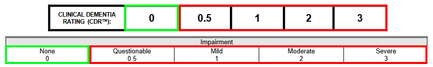
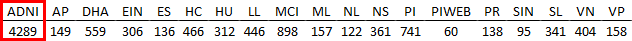
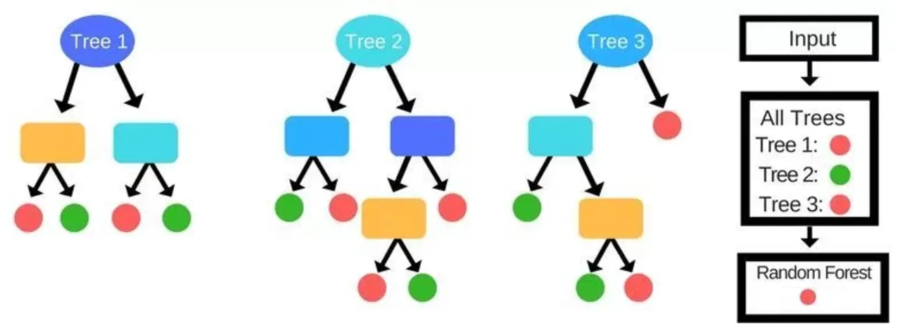
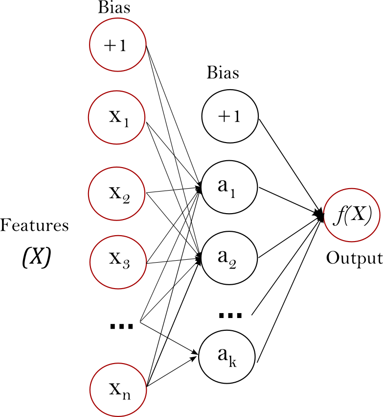
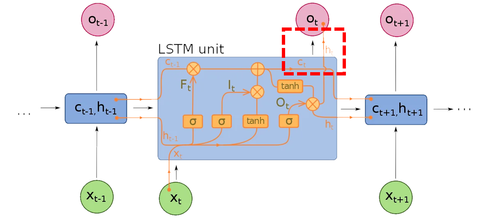
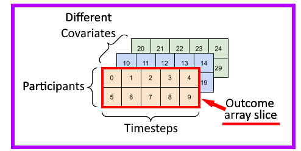
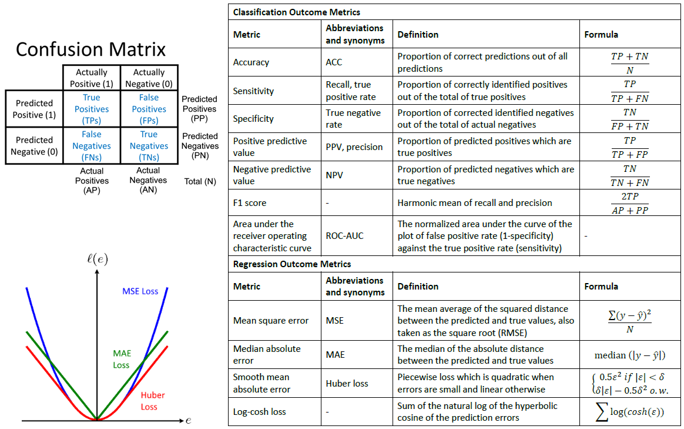
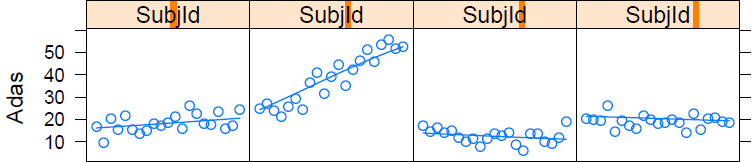

```{r setup, include=FALSE}

R.utils::sourceDirectory("./R/", modifiedOnly = FALSE)

suppressPackageStartupMessages({
  library(shiny)
  library(knitr)
  library(kableExtra)
  library(ggplot2)
})

options(knitr.kable.NA = '')
opts_chunk$set(tidy = FALSE)

boot_dat <- readRDS("boot_data.rds")
boot_ref <- readRDS("boot_ref.rds")
comp_table <- readRDS("boot_compare_wobs.rds")  #Use boot_compare.rds if you don't want to combine observations

dir.base <- "E:/UAB SOPH/Dissertation/Full Project - Meta Database/"
eval_true <- readRDS(paste0(dir.base, "RandEff Impute/impute_true.rds"))
eval_synth <- readRDS(paste0(dir.base, "RandEff Impute/impute_synth.rds"))

data_curr_orig <- readRDS(paste0(dir.base, "MERF/_targets/objects/holdout_split_dat"))
dat <- data_curr_orig$all
dat_bl <- data_curr_orig$bl

```

```{r xaringan-scribble, echo=FALSE}
xaringanExtra::use_scribble()
```

```{r xaringan-tile-view, echo=FALSE}
xaringanExtra::use_tile_view()
```

```{r broadcast, echo=FALSE}
xaringanExtra::use_broadcast()
```


## Outline
.large[
- Overview, objectives and aims

- General approach and design

- Aim 1: Ensemble tree methods

- Aim 2: Sequential neural networks

- Aim 3: Subject-specific effects

- Final thoughts

]

---

## Overview - Inference/Prediction


The goal of statistics is to learn from data, commonly with <u>inference</u> and <u>prediction</u><br>
<br>
Although intrinsically related there are subtle differences in these approaches


.pull-left[
.large[Inference]

- Use the model to learn about the data generation process

- Explain the relationship between a response and covariates

- Frequently emphasizes unbiased interpretation of this relationship

- Commonly discussed within the context of hypothesis testing

]


.pull-right[

.large[Prediction]

- Use the model to determine likely outcomes from the data

- Role of covariates is to aid in calculating a response

- Emphasis on generalization to unseen data 

- The primary focus of machine/statistical learning (ML/SL)

]

---

## Overview - Machine Learning

Benefited from improvements in computational power and data management<br> 
<br>
Application in fields as varied as as finance, transportation and medicine

.pull-left[

- Image processing

- Identification / Classification

- Intelligent agents

- Natural language tasks

- Text mining

- Decision support

]


.pull-right[

```{r out.width="85%", out.height="85%", echo=F, out.extra='style="margin-left: auto; margin-right:auto; display: block"'}

```

]


With extensive neuroimaging, genetic, biomarker, and clinical demographics, Alzheimer's disease (AD) and related dementias are ideal for ML applications

.footnote[https://www.quora.com/What-are-some-real-world-examples-of-applications-of-machine-learning-in-the-field]

---


layout: false

<h2 style="margin-bottom: 10px;">Overview - Alzheimer's Disease</h2>

.pull-left[

```{r echo=F, out.extra='style="margin-left: auto; margin-right:auto; display: block"'}

```

]

.pull-right[
<div style="margin-top: 75px; margin-bottom: 50px">

With the ever-aging population, AD is an increasingly prominent issue

<div style="margin-top: 50px; margin-bottom: 50px"> </div>

Cost and pervasiveness are enormous

<div style="margin-top: 50px; margin-bottom: 50px"> </div>

Pathological and biological hallmarks of AD precede cognitive disability

<div style="margin-top: 50px; margin-bottom: 50px"> </div>

The ideal is identification of at risk patients who could benefit from preventative measures

]


.footnote[https://alz.org/alzheimers-dementia/facts-figures]

---


## Overview - ML/SL and AD

The potential is clear: a PubMed search returned 1355 results with 330 in 2020 alone; arxiv.org cited another 230+ articles  

However, substantial limitations remain:

 - Models <b>focus on clinical diagnosis</b> as a classification response which emphasizes (possibly erroneous) clinician judgment over arguably more objective measures
 
 - Most AD applications <b>use cross-sectional methods</b> and rarely leverage repeated measures or subject-specific effects; a literature review from 2021 found only 8% of 65 reviewed article explicitly used longitudinal methods
 
 - Direct <b>model-to-model comparisons are limited</b> as novel paradigms are developed and pre-defined reference models are rare
 
 - <b>Variety of dataset utilization is restricted</b>, routinely leaning on a well-known observational cohort (ADNI) that has its own issues


.footnote[Kumar S et. al. <i>JAMIA Open</i>. 2021.  4(3): 1-10.]

---


## Overview - Objectives

This dissertation sought to remedy these deficiencies by comprehensively comparing the predictive capacity of a variety of longitudinal extensions of ML/SL techniques in a <b>harmonized multi-study dataset of Alzheimer's disease</b>

- Two classes of responses, <b>one continuous and one binary</b>, to contrast model ability for both regression and classification on cognitive outcomes with specific contexts

- Evaluation of <b>several distinct longitudinal ML/SL model designs</b> including<br>pre-specified inferential methods as reference

- Consideration of two types of prediction: <b>*de novo* whole subject trajectories</b> and <b>forecasting of final observations</b> leveraging prior observed data

- Assessment of the influence of <b>subject-specific effects</b> on outcome prediction

This research sought to address the questions of which longitudinal ML/SL methods give the best performance for AD outcomes, was prediction superior to pre-determined references, and what was the impact of subject-specific effects

---


<h2 style="margin-top: 15px; margin-bottom: 0px;">Specific Aims </h2>

<div style="margin-top: 15px; font-size: 28px";><b>Aim 1</b></div>

Assessment of the predictive performance for <b>ensemble tree-based methods</b> with adaptations specific to longitudinal data when applied to AD specific outcomes  

1. Mixed-effects random forest (MERF)

2. Bootstrap aggregated (bagged) mixed-effects trees

3. Sequential boosting on mixed-effects trees (boosted)

Specifically, this research asked: 
- What were the regression and classification metrics for these models

- Were they superior to the pre-specified inferential references

- How did they rank against each other

- Were these patterns different when outcomes were predicted as trajectories versus forecasting of observations 


---

<h2 style="margin-top: 15px; margin-bottom: 0px;">Specific Aims </h2>

<div style="margin-top: 15px; font-size: 28px";><b>Aim 2</b></div>

To contrast against the ensemble methods using <b>longitudinal extensions of<br>deep-learning neural network</b> model designs 

Structured around <b>sequential neural networks</b> have been applied to other types panel data using their natural extensions to time-dependent data 

1. Long short-term memory recurrent neural networks (LSTM RNN)

2. One-dimensional convolutional neural networks (1D CNN)

3. Non-sequential feed-forward neural networks as a reference (FNN)

A similar research question pipeline to aim 1:
- What is the prediction performance for the networks 

- Which gave superior prediction among themselves and the references 

- Are these patterns consistent for different prediction types

---

<h2 style="margin-top: 15px; margin-bottom: 0px;">Specific Aims </h2>

<div style="margin-top: 15px; font-size: 28px";><b>Aim 3</b></div>

Longitudinal models often utilize subject-specific effects; prediction with longitudinal machine learning is no different  

The <b>influence of subject-specific effects on trajectories and forecasting</b> considered:

1. Suppression of subject-specific effects to only use population-level covariates

2. Imputation of subject-specific effects based on model parameterizations

3. Directly leveraging subject-specific effects when forecasting future observations based on prior data

These evaluations specifically investigated:

- Superiority in regression prediction among 1) a pre-parameterized reference,<br>2) an equivalent *de novo* regression model and 3) the MERF ensemble method

- Examined using 1) a 2-year subset of the meta-database and <br> 2) extended 5-year synthetic datasets for validation


---

## Approach - Outcomes


**Continuous outcome for regression**  
**Alzheimer's disease assessment scale - cognitive sub-scale (ADAS-Cog)**

- A multi-domain assessment battery to evaluate memory, reasoning, orientation, and language with a continuous 70 point scale with <b>higher scores indicative of greater levels of impairment</b>

- Used in clinical trials as a more gradual and refined outcome of cognition

- Has higher resolution at greater levels of impairment; giving it greater capacity to distinguish severity among the impaired

- <b>3-4 points over 6 months</b> may be appropriate for clinically meaningful change

- Loses sensitivity when assessing the cognitively intact


```{r out.width="55%", echo=F, out.extra='style="margin-left: auto; margin-right:auto; display: block"'}

```

.footnote[Schrag A, et al. <i>J Neurol Neurosurg Psyc</i>. 2012. 83(2):171-3.]
  
---

## Approach - Outcomes

**Categorical outcome for classification**  
**Impairment status from the Clinical Dementia Rating (CDR)**

- A five-point scale for six domains of <b>both cognitive and functional ability</b>

- Used as diagnostic tool in clinical settings and a metric in dementia studies

- Global scores of 0.5 indicate "very mild" or "questionable" dementia with higher scores (1, 2, 3) noting increasing degrees of dementia

- A score of 0.5 was taken as the breakpoint - <b><span style="color: lime">non-impaired</span> vs <span style="color: red">impaired</span></b> 

- Classification originally designed to emphasize earlier stages of decline more relevant to clinical patients


```{r out.width="75%", echo=F, out.extra='style="margin-left: auto; margin-right:auto; display: block"'}

```

  

---


## Approach - Reference Models


Mixed-effects regression models were used as inferential reference designs with pre-specified parameterizations for minimum prediction performance

**CPAD parameterization for ADAS-Cog**

 * Simulation model for generation of synthetic cohorts in AD clinical trials
 
 * Used mixed-effects beta regression for ADAS-Cog progression parameterizing:
   1. Baseline age
   2. Sex
   3. APOE4 carrier status
   4. Baseline MMSE
   
 * Provides both fixed effect parameters for the above covariates and random effects variances for intercept and slope
 

```{r out.width="65%", echo=F, out.extra='style="margin-left: auto; margin-right:auto; display: block"'}

```


---

## Approach - Reference Models


Mixed-effects regression models were used as inferential reference designs with pre-specified parameterizations for minimum prediction performance

**CDR impairment status built ad hoc**

 * Built using mixed-effects logisitic regression with a holdout subset of the<br>multi-study database
 
 * Follows the same parameterization scheme as the CPAD ADAS-Cog model with population-level covariates and subject-specific random effects
 
 * Unstructured random effects design with intercept and slope and a covariance term between the components
 
 * Exception is no time-based interactions which impeded model convergence due to overfitting; a facet of the meta-database we'll return to soon
<div style="margin-top:5px"> </div>
```{r out.width="100%", echo=F, out.extra='style="margin-left: auto; margin-right:auto; display: block"'}

```


---


## Approach - Meta-database

 - Assembled from the control participants of 18 AD clinical trials as part of the Alzheimer's Disease Cooperative Study (ADCS) and the four phases of the Alzheimer's Disease Neuroimaging Initiative (ADNI) observational study
 
 - Full dataset includes 8936 unique participants with almost 47000 time points, <span style="color: red">about half (48%) being ADNI</span>
 

```{r echo=F, out.extra='style="margin-left: auto; margin-right:auto; display: block"'}

```

 - Clinical trial data largely limited to 2-3 year studies; some ADNI observational data extends out to 12 years

 - Covariates selected for association with cognition and adequate coverage
  * Baseline / demographics:<br><b>age</b>, <b>sex</b>, race (3 level), ethnicity (2 level), education (5 level),<br>use of anti-dementia medication, <b>APOE4 allele count</b>
  * Time-varying covariates:<br><b>MMSE score</b>, weight, blood pressure
 


---

## Approach - Validation Sets


```{r echo=F, out.extra='style="margin-left: auto; margin-right:auto; display: block"'}

```


---

## A Messy (but Realistic) Dataset

- About 60% of the subjects were dropped during harmonization
  * Four ADCS studies missing ADAS-Cog or CDR scores
  * 2700+ missing APOE4 (e.g. screen failures and exclusions where t=1)
  * Still favored ADNI despite best efforts (40-42% of training set)

- Culled the maximum time to 6 years to avoid further emphasis of ADNI and influence of "super agers"

- Recall, the logistic reference model:<br>
<span style="text-align: center"><b>Impairment of CDR status is relatively stable so impairment tends not to change within subjects; especially true for ADCS trial data</b></span>

- The final harmonized dataset is messy but also realistic for applied machine learning designs using aggregated and combined data; <b>this was desired</b>

- Not ideal although none of this detracts from the research question at hand: <b>comparative ML model performance / influence of subject-specific effects</b>

---

## Approach - Ensemble Methods

<h3 style="margin-top: -15px; margin-bottom: 0px">Bagging on GLMM Trees</h3>

.pull-left[

- Bagging - "bootstrap aggregation"

- <b>Randomly samples participants</b> from the training dataset<br><b>to build several trees</b>

- Average over the collection of trees when predicting

- Benefit is tree pruning is not necessary; limits hyperparameters

- Single, non-bagged GLMM tree as<br>another reference (<b>single GLMM</b>)

]

.pull-right[


```{r out.width="90%", echo=F, out.extra='style="margin-left: auto; margin-right:auto; display: block"'}
knitr::include_graphics("Images/bagging.jpg")
```

]

.footnote[https://www.kdnuggets.com/2019/09/ensemble-learning.html]

---

## Approach - Ensemble Methods

<h3 style="margin-top: -15px; margin-bottom: 0px">Boosting on Mixed-Effect Trees</h3>


.pull-left[

- Also uses GLMM trees but leverages the entire training set

- <b>Boosting modifies the dataset after a tree is fit</b>

- <b>Iterative process</b> so repeated boosting improves the model

- Think iteratively reweighted<br>least-square for trees

- Tree-specific hyperparameters (e.g. tree depth) are more important compared to bagging/MERF


]

.pull-right[


```{r out.width="75%", echo=F, fig.align='right', out.extra='style="margin-left: auto; margin-right:auto; display: block"'}
knitr::include_graphics("Images/boosting.jpg")
```

]

.footnote[https://www.kdnuggets.com/2019/09/ensemble-learning.html]


---

## Approach - Ensemble Methods


<h3 style="margin-top: -15px; margin-bottom: 0px">Mixed-effect random forest</h3>

- Instead of randomly sampling the subjects as in bagging, <b>random forests sample from the covariate features</b>

- Builds a forest of uncorrelated trees, tree-specific hyperparameters less critical

- Aggregates an outcome from the average/majority vote across the whole forest

- For all of these GLMM tree methods, <b>the subject-specific components are implemented in the leaf nodes of the trees using mixed-effects models</b>


```{r out.width="55%", echo=F, fig.align='right', out.extra='style="margin-left: auto; margin-right:auto; display: block"'}

```

.footnote[https://syncedreview.com/2017/10/24/]

---


## Approach - Neural Networks

<h3 style="margin-top: -15px; margin-bottom: 0px">Feed Forward Neural Networks</h3>


.pull-left[

- Built as a control design against the sequential adaptations

- The most fundamental type of neural network

- Considered time as just<br>another covariate

- Views each observation as independent 

- Akin to using an OLS model for longitudinal data


]


.pull-right[

<br>  
```{r out.width="85%", echo=F, fig.align='right', out.extra='style="margin-left: auto; margin-right:auto; display: block; margin-top: auto; margin-bottom: auto; vertical-align: middle"'}

```


]


.footnote[https://scikit-learn.org/stable/modules/neural_networks_supervised.html]

---


## Approach - Neural Networks

<h3 style="margin-top: -15px; margin-bottom: 0px">LSTM Recurrent Neural Networks</h3>

- Origins in natural language processing; using previous word sequences to generate subsequent sets

- Extends naturally to time-dependent data by using prior sequence information

- Long-term sequence retention is controlled by a "<span style="color: red">forget gate</span>"

- Short-term info gets passed along with whatever long-term data is retained


```{r out.width="65%", echo=F, fig.align='right', out.extra='style="margin-left: auto; margin-right:auto; display: block"'}

```


---

## Approach - Neural Networks

<h3 style="margin-top: -15px; margin-bottom: 0px">1D Convolutional Neural Networks</h3>


.pull-left[

- Roots in image processing to extract image features like edges or curves

- Uses a <span style="color: purple">sliding window (kernel)</span> to extract smaller contiguous sequences

- Naturally extends to time data with a <span style="color: red">1D unidirectional window</span>

- Convolution windows get progressively smaller for finer feature identification


]


.pull-right[

```{r out.width="100%", fig.show='as.is', echo=F, out.extra='style="margin-left: auto; margin-right:auto; margin-left: auto; display: block;"'}
knitr::include_graphics(c("Images/cnn_1.png"))
```

```{r out.width=c("50%"), fig.show='hold', echo=F, out.extra='style="margin-top: auto; margin-bottom:auto; margin-right: auto; margin-left: auto; display: block;vertical-align: middle;"'}
knitr::include_graphics(c("Images/cnn_2.png"))
```

```{r out.width=c("850%"), fig.show='hold', echo=F, out.extra='style="margin-top: auto; margin-bottom:auto; margin-right: auto; margin-left: auto; display: block;vertical-align: middle;"'}
knitr::include_graphics(c("Images/cnn_3.png"))
```


]


---

## Approach - General Considerations

<h3 style="margin-top: -15px; margin-bottom: 0px">Building a sequence <i>de novo</i></h3>

- All these methods do some sort of linear algebra on matrices and vectors

- Ensemble trees and feed-forward networks can do this in one step; <b>sequential neural networks cannot because they use <span style="color: purple">multi-dimensional arrays</span></b>

- Sequential neural networks build one time-step at a time, an issue when defining the first time step since <b><span style="color: red">the array slice for outcome starts empty</span></b>

- <b>Due to this iterative nature, LSTM RNN and 1D CNN had outcomes at time 0 predicted from a FNN built using baseline data</b>

- Any subsequent timesteps used the sequential models for prediction


```{r out.width="45%", echo=F, fig.align='right', out.extra='style="margin-left: auto; margin-right:auto; display: block"'}

```


---


## Approach - Prediction Metrics
<div style="margin-bottom: 25px"> </div>

```{r out.width="100%", echo=F, out.extra='style="margin-left: auto; margin-right:auto; margin-left: auto; display: block;"'}

```


<div style="margin-top: 25px; text-align: center">Evaluated using 10,000-fold bootstrapping</div>


---

class: center, middle

#Preliminary Results  
#Reference Models


---


<h2 style="margin-top: 0px; margin-bottom: 5px">Reference - ADAS CPAD</h2>

```{r, echo=F, out.extra='style="margin-left: auto; margin-right:auto; display: block"'}


dir.base <- "E:/UAB SOPH/Dissertation/Full Project - Meta Database/"

merf.dir <- paste0(dir.base, "MERF/From Cheaha/_targets/objects/")

adas_plot <- readRDS(paste0(merf.dir, "refmod_adas_eval_plots"))

adas_eval <- adas_ref <- readRDS(paste0(merf.dir, "refmod_adas_holdout_eval"))

adas_plot_obs <- readRDS(paste0(merf.dir, "refmod_adas_eval_plots_obs_noRE"))

adas_eval_obs <- adas_ref_obs <- readRDS(paste0(merf.dir, "refmod_adas_holdout_eval_obs_noRE"))

```


.pull-left[
<div style="margin-top: 1px; margin-bottom: -5px; text-align:center">Whole Subject Trajectories</div>

```{r, echo=F, fig.width=7.5, fig.height=5, out.extra='style="margin-left: auto; margin-right:auto; display: block"'}

plot_pred_adas_rebuild(adas_plot[[1]]$plot$data)

```
<div style="margin-bottom: -5px"></div>

```{r, echo=F, fig.width=7.5, fig.height=5, out.extra='style="margin-left: auto; margin-right:auto; display: block"'}

plot_diff_adas_rebuild(adas_plot[[1]]$diff$data)

```


]


.pull-right[
<div style="margin-top: 1px; margin-bottom: -5px; text-align:center">Final Observation Forecasts</div>

```{r, echo=F, fig.width=7.5, fig.height=5, out.extra='style="margin-left: auto; margin-right:auto; display: block"'}

plot_pred_adas_rebuild(adas_plot_obs[[1]]$plot$data)

```
<div style="margin-bottom: -5px"></div>

```{r, echo=F, fig.width=7.5, fig.height=5, out.extra='style="margin-left: auto; margin-right:auto; display: block"'}

plot_diff_adas_rebuild(adas_plot_obs[[1]]$diff$data)

```


]
```{r, echo=F}
tab_curr_base <- rbind(adas_eval[[1]]$All, adas_eval_obs[[1]]$All)
tab_curr_base$time <- as.character(tab_curr_base$time); tab_curr_base$time <- c(rep("Trajectories",nrow(adas_eval[[1]]$All)), rep("Forecasts",nrow(adas_eval[[1]]$All)))
tab_curr_base <- table_proc_cont(tab_curr_base, .type=TRUE)
tab_curr <- 
  knitr::kable(tab_curr_base, "html",
               align = c("ccc"),
               escape=F, linesep="")
tab_curr <- row_spec(tab_curr, c(1:nrow(tab_curr_base)), bold=T)
tab_curr <- kable_styling(tab_curr, font_size=18, full_width =F)

tab_curr

```


---


<h2 style="margin-top: 0px; margin-bottom: 5px">Reference - CDR Logisitic</h2>

```{r, echo=F, out.extra='style="margin-left: auto; margin-right:auto; display: block"'}

cdr_plot <- readRDS(paste0(merf.dir, "refmod_cdr_eval_plots"))

cdr_eval <- cdr_ref <- readRDS(paste0(merf.dir, "refmod_cdr_holdout_eval"))

cdr_plot_obs <- readRDS(paste0(merf.dir, "refmod_cdr_eval_plots_obs_noRE"))

cdr_eval_obs <- cdr_ref_obs <- readRDS(paste0(merf.dir, "refmod_cdr_holdout_eval_obs_noRE"))

```


.pull-left[
<div style="margin-top: 1px; margin-bottom: -5px; text-align:center">Whole Subject Trajectories</div>

```{r, echo=F, fig.width=7.5, fig.height=5, out.extra='style="margin-left: auto; margin-right:auto; display: block"'}

plot_pred_cdr_rebuild(cdr_plot[[1]]$plot$data)

```
<div style="margin-bottom: -5px"></div>

```{r, echo=F, fig.width=7.5, fig.height=5, out.extra='style="margin-left: auto; margin-right:auto; display: block"'}

plot_diff_cdr_rebuild(cdr_plot[[1]]$diff$data, (cdr_plot[[1]]$plot$data))

```
<div style="margin-bottom: 1px"></div>

]


.pull-right[
<div style="margin-top: 1px; margin-bottom: -5px; text-align:center">Final Observation Forecasts</div>

```{r, echo=F, fig.width=7.5, fig.height=5, out.extra='style="margin-left: auto; margin-right:auto; display: block"'}

plot_pred_cdr_rebuild(cdr_plot_obs[[1]]$plot$data)

```
<div style="margin-bottom: -5px"></div>

```{r, echo=F, fig.width=7.5, fig.height=5, out.extra='style="margin-left: auto; margin-right:auto; display: block"'}

plot_diff_cdr_rebuild(cdr_plot_obs[[1]]$diff$data, (cdr_plot_obs[[1]]$plot$data))

```
<div style="margin-bottom: 1px"></div>

]
```{r, echo=F}
tab_curr_base <- rbind(cdr_eval[[1]]$All, cdr_eval_obs[[1]]$All)
tab_curr_base$time <- as.character(tab_curr_base$time); tab_curr_base$time <- c(rep("Trajectories",nrow(cdr_eval[[1]]$All)), rep("Forecasts",nrow(cdr_eval_obs[[1]]$All)))
tab_curr_base <- table_proc_cat(tab_curr_base, .type=TRUE)
tab_curr <- 
  knitr::kable(tab_curr_base, "html",
               align = c("ccc"),
               escape=F, linesep="")
tab_curr <- row_spec(tab_curr, c(1:nrow(tab_curr_base)), bold=T)
tab_curr <- kable_styling(tab_curr, font_size=18, full_width =F)

tab_curr

```


---

## Reference Model Observations

 - The <b>CPAD model performed better when predicting entire trajectories</b> compared to final observation forecasting
 
 - The logistic regression model for impairment <b>largely suffered from false negatives</b>; positive predictive value was notably high although an overall increase in misclassification at later times was observed
 
 - There was a drop in predictive capacity when forecasting final observations for the CDR model but <b>classification was more equitable between trajectories and forecasting in the logistic reference model</b> relative to the variance increase seen in the CPAD model for ADAS-Cog
 
 - Regardless, <b>both models performed reasonably well</b> given their limited covariate sets and lack of subject-specific effects
 
 - Both models displayed room for improvement in predictive ability
 
 


---


class: center, middle

#Aim 1 Results  
#Ensemble Methods


---

## Aim 1 - Ensemble ADAS Summary

<div style="text-align: center; font-size: 32px"><b>Whole Subject Trajectories</b></div>
```{r, echo=F, out.extra='style="margin-left: auto; margin-right:auto; display: block"'}

merf.dir <- paste0(dir.base, "MERF/From Cheaha/_targets/objects/")
glmer_ref.dir <- paste0(dir.base, "MERF_glmer/GLMER_ref/")
glmer.dir <- paste0(dir.base, "MERF_glmer/Assembly/")
mvtboost.dir <- paste0(dir.base, "MERF_mvt/From Cheaha/_targets/objects/")

adas_eval <- adas_ref <- readRDS(paste0(merf.dir, "refmod_adas_holdout_eval"))
adas_eval_obs <- adas_ref_obs <- readRDS(paste0(merf.dir, "refmod_adas_holdout_eval_obs_noRE"))

adas_merf_eval <- readRDS(paste0(merf.dir, "merf_adas_holdout_eval"))
adas_merf_eval_obs <- readRDS(paste0(merf.dir, "merf_adas_holdout_eval_obs"))
adas_glmer_eval <- readRDS(paste0(glmer_ref.dir, "glmertree_ref_adas_holdout_eval"))
adas_glmer_eval_obs <- readRDS(paste0(glmer_ref.dir, "glmertree_ref_adas_holdout_eval_obs"))
adas_bagged_eval <- readRDS(paste0(glmer.dir, "glmertree_bagged_adas_holdout_eval"))
adas_bagged_eval_obs <- readRDS(paste0(glmer.dir, "glmertree_bagged_adas_holdout_eval_obs"))
adas_mvtboost_eval <- readRDS(paste0(mvtboost.dir, "mvtboost_adas_holdout_eval"))
adas_mvtboost_eval_obs <- readRDS(paste0(mvtboost.dir, "mvtboost_adas_holdout_eval_obs"))

list_adas <- list(adas_merf_eval, adas_glmer_eval, adas_bagged_eval, adas_mvtboost_eval)
list_adas_obs <- list(adas_merf_eval_obs, adas_glmer_eval_obs, adas_bagged_eval_obs, adas_mvtboost_eval_obs)

adas_summ <- table_summ_build(list_adas, adas_ref)
tab_curr <- 
  knitr::kable(adas_summ, "html",
               align = c("l",rep("c", ncol(adas_summ)-1)),
               escape=F, linesep="")

tab_curr <- column_spec(tab_curr, 2, border_right = "4px solid red")
tab_curr <- column_spec(tab_curr, 3, border_left = "4px solid red")
tab_curr <- column_spec(tab_curr, c(3,6), width = "4em")
tab_curr <- row_spec(tab_curr, 1, bold=T)
tab_curr <- row_spec(tab_curr, seq(2,nrow(adas_summ),2), background = "white")
tab_curr <- row_spec(tab_curr, seq(1,nrow(adas_summ),2), extra_css = "background-color: #EEEEEE")


#tab_curr <- kable_styling(tab_curr, font_size=22, full_width =F)
tab_curr
```

<br>

<div style="text-align: center; font-size: 32px"><b>Final Observation Forecasting</b></div>
```{r, echo=F, out.extra='style="margin-left: auto; margin-right:auto; display: block"'}
adas_summ_obs <- table_summ_build(list_adas_obs, adas_eval_obs)
tab_curr <- 
  knitr::kable(adas_summ_obs, "html",
               align = c("l",rep("c", ncol(adas_summ_obs)-1)),
               escape=F, linesep="")
tab_curr <- column_spec(tab_curr, 2, border_right = "4px solid red")
tab_curr <- column_spec(tab_curr, 3, border_left = "4px solid red")
tab_curr <- column_spec(tab_curr, c(3,6), width = "4em")
tab_curr <- row_spec(tab_curr, 1, bold=T)
tab_curr <- row_spec(tab_curr, seq(2,nrow(adas_summ_obs),2), background = "white")
tab_curr <- row_spec(tab_curr, seq(1,nrow(adas_summ_obs),2), extra_css = "background-color: #EEEEEE")
#tab_curr <- kable_styling(tab_curr, font_size=22, full_width =F)
tab_curr

```


---


## Aim 1 - ADAS MERF Trajectories

```{r, echo=F, out.extra='style="margin-left: auto; margin-right:auto; display: block"'}

adas_plot <- readRDS(paste0(merf.dir, "merf_adas_eval_plots"))

adas_eval <- readRDS(paste0(merf.dir, "merf_adas_holdout_eval"))

boot_curr <- boot_dat[["merf"]]

```

.pull-left[

```{r, echo=F, fig.width=9, fig.height=6, out.extra='style="margin-left: auto; margin-right:auto; display: block"'}

plot_ex_1 <- plot_pred_adas_rebuild(adas_plot[[1]]$plot$data)
plot_ex_1
```


]

.pull-right[
```{r, echo=F, fig.width=9, fig.height=6, out.extra='style="margin-left: auto; margin-right:auto; display: block"'}

plot_ex_2 <- plot_diff_adas_rebuild(adas_plot[[1]]$diff$data)
plot_ex_2

```

]
<br>
<br>

```{r, echo=F}
tab_boot_base <- tab_proc_boot(boot_curr$adas, adas_eval[[1]]$All, adas_ref[[1]]$All, boot_ref[["adas"]])
tab_boot <- 
  knitr::kable(tab_boot_base[["tab"]], "html",
               align = rep("c",6),
               escape=F, linesep="",
               #caption = "Across all times"
               )
tab_boot <- kable_styling(tab_boot, font_size=20, full_width =F)

tab_boot

```


---


## Aim 1 - ADAS <span style="color: red"><b>MERF</b> Trajectories</span>


.pull-left[

```{r, echo=F, fig.width=9, fig.height=6, out.extra='style="margin-left: auto; margin-right:auto; display: block"'}

plot_ex_1

```


]

.pull-right[
```{r, echo=F, fig.width=9, fig.height=6, out.extra='style="margin-left: auto; margin-right:auto; display: block"'}

plot_ex_2

```

]
<br>
<br>

```{r, echo=F}
tab_boot_base <- tab_proc_boot(boot_curr$adas, adas_eval[[1]]$All, adas_ref[[1]]$All, boot_ref[["adas"]])
tab_boot <- 
  knitr::kable(tab_boot_base[["tab"]], "html",
               align = rep("c",6),
               escape=F, linesep="",
               #caption = "Across all times"
               )
tab_boot <- column_spec(tab_boot, c(2,3), background = "yellow")
tab_boot <- kable_styling(tab_boot, font_size=20, full_width =F)

tab_boot

```


---


## Aim 1 - ADAS MERF Trajectories


.pull-left[

```{r, echo=F, fig.width=9, fig.height=6, out.extra='style="margin-left: auto; margin-right:auto; display: block"'}

plot_ex_1

```


]

.pull-right[
```{r, echo=F, fig.width=9, fig.height=6, out.extra='style="margin-left: auto; margin-right:auto; display: block"'}

plot_ex_2

```

]
<br>
<br>

```{r, echo=F}
tab_boot_base <- tab_proc_boot(boot_curr$adas, adas_eval[[1]]$All, adas_ref[[1]]$All, boot_ref[["adas"]])
tab_boot <- 
  knitr::kable(tab_boot_base[["tab"]], "html",
               align = rep("c",6),
               escape=F, linesep="",
               #caption = "Across all times"
               )
tab_boot <- column_spec(tab_boot, c(4,5), background = "yellow")
tab_boot <- kable_styling(tab_boot, font_size=20, full_width =F)

tab_boot

```


---


## Aim 1 - ADAS MERF Trajectories


.pull-left[

```{r, echo=F, fig.width=9, fig.height=6, out.extra='style="margin-left: auto; margin-right:auto; display: block"'}

plot_ex_1

```


]

.pull-right[
```{r, echo=F, fig.width=9, fig.height=6, out.extra='style="margin-left: auto; margin-right:auto; display: block"'}

plot_ex_2

```

]
<br>
<br>

```{r, echo=F}
tab_boot_base <- tab_proc_boot(boot_curr$adas, adas_eval[[1]]$All, adas_ref[[1]]$All, boot_ref[["adas"]])
tab_boot <- 
  knitr::kable(tab_boot_base[["tab"]], "html",
               align = rep("c",6),
               escape=F, linesep="",
               #caption = "Across all times"
               )
tab_boot <- column_spec(tab_boot, c(6), background = "yellow")
tab_boot <- kable_styling(tab_boot, font_size=20, full_width =F)

tab_boot

```


---


## Aim 1 - ADAS MERF <span style="color: red">Trajectories</span>


.pull-left[

```{r, echo=F, fig.width=9, fig.height=6, out.extra='style="margin-left: auto; margin-right:auto; display: block"'}

plot_ex_1

```


]

.pull-right[
```{r, echo=F, fig.width=9, fig.height=6, out.extra='style="margin-left: auto; margin-right:auto; display: block"'}

plot_ex_2

```

]
<br>
<br>

```{r, echo=F}
tab_boot_base <- tab_proc_boot(boot_curr$adas, adas_eval[[1]]$All, adas_ref[[1]]$All, boot_ref[["adas"]])
tab_boot <- 
  knitr::kable(tab_boot_base[["tab"]], "html",
               align = rep("c",6),
               escape=F, linesep="",
               #caption = "Across all times"
               )
tab_boot <- column_spec(tab_boot, c(5), background = "yellow")
tab_boot <- kable_styling(tab_boot, font_size=20, full_width =F)

tab_boot

```


---


## Aim 1 - ADAS GLMM <span style="color: red">Forecasting</span>

```{r, echo=F, out.extra='style="margin-left: auto; margin-right:auto; display: block"'}

adas_plot <- readRDS(paste0(glmer_ref.dir, "glmertree_ref_adas_eval_plots_obs"))

adas_eval <- readRDS(paste0(glmer_ref.dir, "glmertree_ref_adas_holdout_eval_obs"))

boot_curr <- boot_dat[["glmertree_ref"]]

```

.pull-left[

```{r, echo=F, fig.width=9, fig.height=6, out.extra='style="margin-left: auto; margin-right:auto; display: block"'}

plot_pred_adas_rebuild(adas_plot[[1]]$plot$data)

```


]

.pull-right[
```{r, echo=F, fig.width=9, fig.height=6, out.extra='style="margin-left: auto; margin-right:auto; display: block"'}

plot_diff_adas_rebuild(adas_plot[[1]]$diff$data)

```
]
<br>
<br>

```{r, echo=F}
tab_boot_base <- tab_proc_boot(boot_curr$adas_obs, adas_eval[[1]]$All, adas_ref_obs[[1]]$All, boot_ref[["adas_obs"]])
tab_boot <- 
  knitr::kable(tab_boot_base[["tab"]], "html",
               align = rep("c",6),
               escape=F, linesep="",
               #caption = "Across all times"
               )
tab_boot <- column_spec(tab_boot, c(5), background = "yellow")
tab_boot <- kable_styling(tab_boot, font_size=20, full_width =F)

tab_boot

```


---

## Aim 1 - Ensemble CDR Summary

<div style="text-align: center; font-size: 32px"><b>Whole Subject Trajectories</b></div>
```{r, echo=F, out.extra='style="margin-left: auto; margin-right:auto; display: block"'}

cdr_ref_eval <- cdr_ref <- readRDS(paste0(merf.dir, "refmod_cdr_holdout_eval"))
cdr_ref_eval_obs <- cdr_ref_obs <- readRDS(paste0(merf.dir, "refmod_cdr_holdout_eval_obs_noRE"))

cdr_merf_eval <- readRDS(paste0(merf.dir, "merf_cdr_holdout_eval"))
cdr_merf_eval_obs <- readRDS(paste0(merf.dir, "merf_cdr_holdout_eval_obs"))
cdr_glmer_eval <- readRDS(paste0(glmer_ref.dir, "glmertree_ref_cdr_holdout_eval"))
cdr_glmer_eval_obs <- readRDS(paste0(glmer_ref.dir, "glmertree_ref_cdr_holdout_eval_obs"))
cdr_bagged_eval <- readRDS(paste0(glmer.dir, "glmertree_bagged_cdr_holdout_eval"))
cdr_bagged_eval_obs <- readRDS(paste0(glmer.dir, "glmertree_bagged_cdr_holdout_eval_obs"))
cdr_mvtboost_eval <- readRDS(paste0(mvtboost.dir, "mvtboost_cdr_holdout_eval"))
cdr_mvtboost_eval_obs <- readRDS(paste0(mvtboost.dir, "mvtboost_cdr_holdout_eval_obs"))

list_cdr <- list(cdr_merf_eval, cdr_glmer_eval, cdr_bagged_eval, cdr_mvtboost_eval)
list_cdr_obs <- list(cdr_merf_eval_obs, cdr_glmer_eval_obs, cdr_bagged_eval_obs, cdr_mvtboost_eval_obs)

cdr_summ <- table_summ_build(list_cdr, cdr_ref)
tab_curr <- 
  knitr::kable(cdr_summ, "html",
               align = c("l",rep("c", ncol(cdr_summ)-1)),
               escape=F, linesep="")
tab_curr <- column_spec(tab_curr, 2, border_right = "4px solid red")
tab_curr <- column_spec(tab_curr, 3, border_left = "4px solid red")
tab_curr <- column_spec(tab_curr, c(3,6), width = "4em")
tab_curr <- row_spec(tab_curr, 1, bold=T)
tab_curr <- row_spec(tab_curr, seq(2,nrow(cdr_summ),2), background = "white")
tab_curr <- row_spec(tab_curr, seq(1,nrow(cdr_summ),2), extra_css = "background-color: #EEEEEE")
tab_curr
```

<br>

<div style="text-align: center; font-size: 32px"><b>Final Observation Forecasting</b></div>
```{r, echo=F, out.extra='style="margin-left: auto; margin-right:auto; display: block"'}
cdr_summ_obs <- table_summ_build(list_cdr_obs, cdr_ref_obs)
tab_curr <- 
  knitr::kable(cdr_summ_obs, "html",
               align = c("l",rep("c", ncol(cdr_summ_obs)-1)),
               escape=F, linesep="")
tab_curr <- column_spec(tab_curr, 2, border_right = "4px solid red")
tab_curr <- column_spec(tab_curr, 3, border_left = "4px solid red")
tab_curr <- column_spec(tab_curr, c(3,6), width = "4em")
tab_curr <- row_spec(tab_curr, 1, bold=T)
tab_curr <- row_spec(tab_curr, seq(2,nrow(cdr_summ_obs),2), background = "white")
tab_curr <- row_spec(tab_curr, seq(1,nrow(cdr_summ_obs),2), extra_css = "background-color: #EEEEEE")
tab_curr
```

---

## Aim 1 - CDR Boosted Trajectories

```{r, echo=F, out.extra='style="margin-left: auto; margin-right:auto; display: block"'}

cdr_plot <- readRDS(paste0(mvtboost.dir, "mvtboost_cdr_eval_plots"))

cdr_eval <- readRDS(paste0(mvtboost.dir, "mvtboost_cdr_holdout_eval"))

boot_curr <- boot_dat[["mvtboost"]]

```

.pull-left[

```{r, echo=F, fig.width=9, fig.height=6, out.extra='style="margin-left: auto; margin-right:auto; display: block"'}

plot_pred_cdr_rebuild(cdr_plot[[1]]$plot$data)

```


]

.pull-right[

```{r, echo=F, fig.width=9, fig.height=6, out.extra='style="margin-left: auto; margin-right:auto; display: block"'}

plot_diff_cdr_rebuild(cdr_plot[[1]]$diff$data, (cdr_plot[[1]]$plot$data))

```
]
<br>
<br>
```{r, echo=F}
tab_boot_base <- tab_proc_boot(boot_curr$cdr, cdr_eval[[1]]$All, cdr_ref[[1]]$All, boot_ref[["cdr"]])
tab_boot <- 
  knitr::kable(tab_boot_base[["tab"]], "html",
               align = rep("c",6),
               escape=F, linesep="",
               #caption = tab_boot_base[["NRI"]]
               )
tab_boot <- row_spec(tab_boot, c(2,3), background = "yellow")
tab_boot <- kable_styling(tab_boot, font_size=20, full_width =F)

tab_boot

```
<div style="text-align: center">`r tab_boot_base[["NRI"]]`</div>


---

## Aim 1 - CDR Bagged Forecasting

```{r, echo=F, out.extra='style="margin-left: auto; margin-right:auto; display: block"'}

cdr_plot <- readRDS(paste0(glmer.dir, "glmertree_bagged_cdr_eval_plots_obs"))

cdr_eval <- readRDS(paste0(glmer.dir, "glmertree_bagged_cdr_holdout_eval_obs"))

boot_curr <- boot_dat[["glmertree_bagged"]]

```

.pull-left[

```{r, echo=F, fig.width=9, fig.height=6, out.extra='style="margin-left: auto; margin-right:auto; display: block"'}

plot_pred_cdr_rebuild(cdr_plot[[1]]$plot$data)

```


]

.pull-right[
```{r, echo=F, fig.width=9, fig.height=6, out.extra='style="margin-left: auto; margin-right:auto; display: block"'}

plot_diff_cdr_rebuild(cdr_plot[[1]]$diff$data, (cdr_plot[[1]]$plot$data))

```
]
<br>
<br>
```{r, echo=F}
tab_boot_base <- tab_proc_boot(boot_curr$cdr_obs, cdr_eval[[1]]$All, cdr_ref_obs[[1]]$All, boot_ref[["cdr_obs"]])
tab_boot <- 
  knitr::kable(tab_boot_base[["tab"]], "html",
               align = rep("c",6),
               escape=F, linesep="",
               #caption = tab_boot_base[["NRI"]]
               )
tab_boot <- column_spec(tab_boot, c(2,3), background = "yellow")
tab_boot <- kable_styling(tab_boot, font_size=20, full_width =F)

tab_boot

```
<div style="text-align: center">`r tab_boot_base[["NRI"]]`</div>


---

## Ensemble Methods Observations

- <b>All models performed notably better</b> with respect to both error and bias metrics when predicting ADAS-Cog when <b>compared to the reference CPAD model</b> for both whole trajectories and observational forecasting

- The <b>MERF model was especially unbiased and the best overall predictor for ADAS-Cog</b>; boosted trees performed well for trajectories while the single GLMM tree excelled at forecasting

- For CDR impairment trajectories, <b>ROC AUC was found to be higher for all ensemble methods</b> with improvements in accuracy most likely driven by<br> <b>fewer false negatives</b> resulting in improved recall

- Although improved, <b>recall was still poorer compared to precision</b>; potentially a consequence of this particular dataset's disposition or cutpoint selection

- Critically, when forecasting observations, predictive capacity was exceedingly high; <b>almost certainly a consequence of stable CDR impairment within subjects</b> for the meta-database


---


class: center, middle

#Aim 2 Results  
#Neural Network Methods

---


## Aim 2 - Neural Net ADAS Summary

<div style="text-align: center; font-size: 32px"><b>Whole Subject Trajectories</b></div>
```{r, echo=F, out.extra='style="margin-left: auto; margin-right:auto; display: block"'}

nn.dir <- paste0(dir.base, "Neural Nets/_targets/objects/")

adas_fnn_eval <- readRDS(paste0(nn.dir, "fnn_adas_holdout_eval"))
adas_fnn_eval_obs <- readRDS(paste0(nn.dir, "fnn_adas_holdout_eval_obs"))
adas_cnn_eval <- readRDS(paste0(nn.dir, "cnn_adas_holdout_eval"))
adas_cnn_eval_obs <- readRDS(paste0(nn.dir, "cnn_adas_holdout_eval_obs"))
adas_lstm_eval <- readRDS(paste0(nn.dir, "lstm_adas_holdout_eval"))
adas_lstm_eval_obs <- readRDS(paste0(nn.dir, "lstm_adas_holdout_eval_obs"))

list_adas <- list(adas_fnn_eval, adas_cnn_eval, adas_lstm_eval)
list_adas_obs <- list(adas_fnn_eval_obs, adas_cnn_eval_obs, adas_lstm_eval_obs)

adas_summ <- table_summ_build(list_adas, adas_ref)
tab_curr <- 
  knitr::kable(adas_summ, "html",
               align = c("l",rep("c", ncol(adas_summ)-1)),
               escape=F, linesep="")
tab_curr <- column_spec(tab_curr, 2, border_right = "4px solid red")
tab_curr <- column_spec(tab_curr, 3, border_left = "4px solid red")
tab_curr <- column_spec(tab_curr, 3:5, width = "5em")
tab_curr <- row_spec(tab_curr, 1, bold=T)
tab_curr <- row_spec(tab_curr, seq(2,nrow(adas_summ),2), background = "white")
tab_curr <- row_spec(tab_curr, seq(1,nrow(adas_summ),2), extra_css = "background-color: #EEEEEE")
tab_curr
```

<br>

<div style="text-align: center; font-size: 32px"><b>Final Observation Forecasting:</b></div>
```{r, echo=F, out.extra='style="margin-left: auto; margin-right:auto; display: block"'}
adas_summ_obs <- table_summ_build(list_adas_obs, adas_eval_obs)
tab_curr <- 
  knitr::kable(adas_summ_obs, "html",
               align = c("l",rep("c", ncol(adas_summ_obs)-1)),
               escape=F, linesep="")
tab_curr <- column_spec(tab_curr, 2, border_right = "4px solid red")
tab_curr <- column_spec(tab_curr, 3, border_left = "4px solid red")
tab_curr <- column_spec(tab_curr, 3:5, width = "5em")
tab_curr <- row_spec(tab_curr, 1, bold=T)
tab_curr <- row_spec(tab_curr, seq(2,nrow(adas_summ_obs),2), background = "white")
tab_curr <- row_spec(tab_curr, seq(1,nrow(adas_summ_obs),2), extra_css = "background-color: #EEEEEE")
tab_curr

```
---


## Aim 2 - ADAS <span style="color: red; background: yellow"><b><u>FNN</b></span></u> <span style="color: red">Trajectories</span>

```{r, echo=F, out.extra='style="margin-left: auto; margin-right:auto; display: block"'}

adas_plot <- readRDS(paste0(nn.dir, "fnn_adas_eval_plots"))

adas_eval <- readRDS(paste0(nn.dir, "fnn_adas_holdout_eval"))

boot_curr <- boot_dat[["fnn"]]

```

.pull-left[

```{r, echo=F, fig.width=9, fig.height=6, out.extra='style="margin-left: auto; margin-right:auto; display: block"'}

plot_pred_adas_rebuild(adas_plot[[1]]$plot$data)

```


]

.pull-right[
```{r, echo=F, fig.width=9, fig.height=6, out.extra='style="margin-left: auto; margin-right:auto; display: block"'}

plot_diff_adas_rebuild(adas_plot[[1]]$diff$data)

```
]
<br>
<br>
```{r, echo=F}
tab_boot_base <- tab_proc_boot(boot_curr$adas, adas_eval[[1]]$All, adas_ref[[1]]$All, boot_ref[["adas"]])
tab_boot <- 
  knitr::kable(tab_boot_base[["tab"]], "html",
               align = rep("c",6),
               escape=F, linesep="",
               #caption = "Across all times"
               )
tab_boot <- kable_styling(tab_boot, font_size=20, full_width =F)

tab_boot

```


---


## Aim 2 - ADAS <span style="color: red; background: yellow;"><b><u>LSTM</b></span></u> <span style="color: red">Forecasting</span>

```{r, echo=F, out.extra='style="margin-left: auto; margin-right:auto; display: block"'}

adas_plot <- readRDS(paste0(nn.dir, "lstm_adas_eval_plots_obs"))

adas_eval <- readRDS(paste0(nn.dir, "lstm_adas_holdout_eval_obs"))

boot_curr <- boot_dat[["lstm"]]

```

.pull-left[

```{r, echo=F, fig.width=9, fig.height=6, out.extra='style="margin-left: auto; margin-right:auto; display: block"'}

plot_pred_adas_rebuild(adas_plot[[1]]$plot$data)

```


]

.pull-right[
```{r, echo=F, fig.width=9, fig.height=6, out.extra='style="margin-left: auto; margin-right:auto; display: block"'}

plot_diff_adas_rebuild(adas_plot[[1]]$diff$data)

```
]
<br>
<br>
```{r, echo=F}
tab_boot_base <- tab_proc_boot(boot_curr$adas_obs, adas_eval[[1]]$All, adas_ref_obs[[1]]$All, boot_ref[["adas_obs"]])
tab_boot <- 
  knitr::kable(tab_boot_base[["tab"]], "html",
               align = rep("c",6),
               escape=F, linesep="",
               #caption = "Across all times"
               )
tab_boot <- kable_styling(tab_boot, font_size=20, full_width =F)

tab_boot

```


---

## Aim 2 - Neural Net CDR Summary

<div style="text-align: center; font-size: 32px"><b>Whole Subject Trajectories</b></div>
```{r, echo=F, out.extra='style="margin-left: auto; margin-right:auto; display: block"'}


cdr_fnn_eval <- readRDS(paste0(nn.dir, "fnn_cdr_holdout_eval"))
cdr_fnn_eval_obs <- readRDS(paste0(nn.dir, "fnn_cdr_holdout_eval_obs"))
cdr_cnn_eval <- readRDS(paste0(nn.dir, "cnn_cdr_holdout_eval"))
cdr_cnn_eval_obs <- readRDS(paste0(nn.dir, "cnn_cdr_holdout_eval_obs"))
cdr_lstm_eval <- readRDS(paste0(nn.dir, "lstm_cdr_holdout_eval"))
cdr_lstm_eval_obs <- readRDS(paste0(nn.dir, "lstm_cdr_holdout_eval_obs"))

list_cdr <- list(cdr_fnn_eval, cdr_cnn_eval, cdr_lstm_eval)
list_cdr_obs <- list(cdr_fnn_eval_obs, cdr_cnn_eval_obs, cdr_lstm_eval_obs)

cdr_summ <- table_summ_build(list_cdr, cdr_ref)
tab_curr <- 
  knitr::kable(cdr_summ, "html",
               align = c("l",rep("c", ncol(cdr_summ)-1)),
               escape=F, linesep="")
tab_curr <- column_spec(tab_curr, 2, border_right = "4px solid red")
tab_curr <- column_spec(tab_curr, 3, border_left = "4px solid red")
tab_curr <- column_spec(tab_curr, 3:5, width = "5em")
tab_curr <- row_spec(tab_curr, 1, bold=T)
tab_curr <- row_spec(tab_curr, seq(2,nrow(cdr_summ),2), background = "white")
tab_curr <- row_spec(tab_curr, seq(1,nrow(cdr_summ),2), extra_css = "background-color: #EEEEEE")
tab_curr_traj <- tab_curr
tab_curr
```

<br>

<div style="text-align: center; font-size: 32px"><b>Final Observation Forecasting:</b></div>
```{r, echo=F, out.extra='style="margin-left: auto; margin-right:auto; display: block"'}
cdr_summ_obs <- table_summ_build(list_cdr_obs, cdr_eval_obs)
tab_curr <- 
  knitr::kable(cdr_summ_obs, "html",
               align = c("l",rep("c", ncol(cdr_summ_obs)-1)),
               escape=F, linesep="")
tab_curr <- column_spec(tab_curr, 2, border_right = "4px solid red")
tab_curr <- column_spec(tab_curr, 3, border_left = "4px solid red")
tab_curr <- column_spec(tab_curr, 3:5, width = "5em")
tab_curr <- row_spec(tab_curr, 1, bold=T)
tab_curr <- row_spec(tab_curr, seq(2,nrow(cdr_summ_obs),2), background = "white")
tab_curr <- row_spec(tab_curr, seq(1,nrow(cdr_summ_obs),2), extra_css = "background-color: #EEEEEE")
tab_curr

```

---
## Aim 2 - CDR FNN Trajectories

```{r, echo=F, out.extra='style="margin-left: auto; margin-right:auto; display: block"'}

cdr_plot <- readRDS(paste0(nn.dir, "fnn_cdr_eval_plots"))

cdr_eval <- readRDS(paste0(nn.dir, "fnn_cdr_holdout_eval"))

boot_curr <- boot_dat[["fnn"]]

```

.pull-left[

```{r, echo=F, fig.width=9, fig.height=6, out.extra='style="margin-left: auto; margin-right:auto; display: block"'}

plot_pred_cdr_rebuild(cdr_plot[[1]]$plot$data)

```


]

.pull-right[
```{r, echo=F, fig.width=9, fig.height=6, out.extra='style="margin-left: auto; margin-right:auto; display: block"'}

plot_diff_cdr_rebuild(cdr_plot[[1]]$diff$data, (cdr_plot[[1]]$plot$data))

```
]
<br>
<br>
```{r, echo=F}
tab_boot_base <- tab_proc_boot(boot_curr$cdr, cdr_eval[[1]]$All, cdr_ref[[1]]$All, boot_ref[["cdr"]])
tab_boot <- 
  knitr::kable(tab_boot_base[["tab"]], "html",
               align = rep("c",6),
               escape=F, linesep="",
               #caption = tab_boot_base[["NRI"]]
               )
tab_boot <- row_spec(tab_boot, c(2,4), background = "yellow")
tab_boot <- kable_styling(tab_boot, font_size=20, full_width =F)

tab_boot

```
<div style="text-align: center">`r tab_boot_base[["NRI"]]`</div>


---


## Aim 2 - CDR CNN Forecasting

```{r, echo=F, out.extra='style="margin-left: auto; margin-right:auto; display: block"'}

cdr_plot <- readRDS(paste0(nn.dir, "cnn_cdr_eval_plots_obs"))

cdr_eval <- readRDS(paste0(nn.dir, "cnn_cdr_holdout_eval_obs"))

boot_curr <- boot_dat[["cnn"]]

```

.pull-left[

```{r, echo=F, fig.width=9, fig.height=6, out.extra='style="margin-left: auto; margin-right:auto; display: block"'}

plot_pred_cdr_rebuild(cdr_plot[[1]]$plot$data)

```


]

.pull-right[

```{r, echo=F, fig.width=9, fig.height=6, out.extra='style="margin-left: auto; margin-right:auto; display: block"'}

plot_diff_cdr_rebuild(cdr_plot[[1]]$diff$data, (cdr_plot[[1]]$plot$data))

```
]
<br>
<br>
```{r, echo=F}
tab_boot_base <- tab_proc_boot(boot_curr$cdr_obs, cdr_eval[[1]]$All, cdr_ref_obs[[1]]$All, boot_ref[["cdr_obs"]])
tab_boot <- 
  knitr::kable(tab_boot_base[["tab"]], "html",
               align = rep("c",6),
               escape=F, linesep="",
               #caption = tab_boot_base[["NRI"]]
               )
tab_boot <- column_spec(tab_boot, c(2), background="yellow")
tab_boot <- kable_styling(tab_boot, font_size=20, full_width =F)

tab_boot

```
<div style="text-align: center"><span style="background: yellow">`r tab_boot_base[["NRI"]]`</span></div>


---

## Neural Network Observations

- Despite no direct use of sequential data, <b>the FNN model observed strong predictive ability in ADAS-Cog</b>, most notably for whole trajectories although still performing well with forecasting

- When forecasting ADAS-Cog with the sequential methods, <b>MAE improvements relative to RMSE</b> suggest these networks <b>may be sensitive to outliers</b>

- Regardless, <b>all neural network models performed better compared to the CPAD reference</b> for both ADAS trajectories and forecasting

- Compared to ADAS-Cog prediction, <b>whole trajectories of impairment classification were comparable</b> across the neural network designs

- <b>Immense metrics for sequential network impairment forecasting</b> implicates within-subject CDR stability; although this is <b>mildly tempered by the FNN model</b>

- Issues with trajectory prediction for sequential networks may be due to their <b>iterative calculation</b> and the <b>reliance on a baseline FNN for seeding</b> the outcome array slices


---


class: center, middle

#Aims 1 & 2
#Cross Model Comparisons


---


<h2 style="font-size: 40px; margin-top: 0px; margin-bottom: 5px">ML/SL Comparison - ADAS Regression</h2>

```{r, echo=F}
comp_curr_base <- comp_table[[1]]$RMSE
caption_curr <- "RMSE - Whole Trajectories"

#Subset to build example tables for orientation
comp_curr_base_ex1 <- comp_curr_base
for(i in 1:ncol(comp_curr_base)){
  if(i==1){
    comp_curr_base_ex1[i,i] <- paste0("<div style=\"background-color: lime\">", comp_curr_base_ex1[i,i], "</div>")
  }else {
    comp_curr_base_ex1[i,i] <- paste0("<div style=\"background-color: yellow\">", comp_curr_base_ex1[i,i], "</div>")
  }
}


#comp_curr_base <- remake_comp_table(comp_curr_base)

comp_curr <- 
  knitr::kable(comp_curr_base, "html", 
               align = rep("c", ncol(comp_curr_base)),
               escape = FALSE, linesep = "",
               caption = paste0("<div style=\"color:black; font-size:32px\">", caption_curr, "</div>")
               )
comp_curr <- row_spec(comp_curr, c(1:nrow(comp_curr_base)), extra_css = "vertical-align: middle !important;")
comp_curr <- column_spec(comp_curr, 1, bold=T)
comp_curr <- kable_styling(comp_curr, font_size=16, full_width = FALSE)

comp_curr
```

---

<h2 style="font-size: 40px; margin-top: 0px; margin-bottom: 5px">ML/SL Comparison - ADAS Regression</h2>

```{r, echo=F}
comp_curr <- 
  knitr::kable(comp_curr_base_ex1, "html", 
               align = rep("c", ncol(comp_curr_base)),
               escape = FALSE, linesep = "",
               caption = paste0("<div style=\"color:black; font-size:32px\">", caption_curr, "</div>")
               )
comp_curr <- row_spec(comp_curr, c(1:nrow(comp_curr_base)), extra_css = "vertical-align: middle !important;")
comp_curr <- column_spec(comp_curr, 1, bold=T)
comp_curr <- kable_styling(comp_curr, font_size=16, full_width = FALSE)
comp_curr
```

---

<h2 style="font-size: 40px; margin-top: 0px; margin-bottom: 5px">ML/SL Comparison - ADAS Regression</h2>

```{r, echo=F}
comp_curr_base_ex2 <- comp_curr_base
comp_curr_base_ex2 <- rbind(colnames(comp_curr_base), comp_curr_base)
comp_curr_base_ex2 <- cbind(c("", rownames(comp_curr_base)), comp_curr_base_ex2)
colnames(comp_curr_base_ex2) <- rownames(comp_curr_base_ex2) <- NULL

for(i in 2:ncol(comp_curr_base_ex2)){
  if(i==2){
    comp_curr_base_ex2[1,i] <- paste0("<div style=\"background-color: lime\">", comp_curr_base_ex2[1,i], "</div>")
    comp_curr_base_ex2[i,1] <- paste0("<div style=\"background-color: lime\">", comp_curr_base_ex2[i,1], "</div>")
  }else {
    comp_curr_base_ex2[1,i] <- paste0("<div style=\"background-color: yellow\">", comp_curr_base_ex2[1,i], "</div>")
    comp_curr_base_ex2[i,1] <- paste0("<div style=\"background-color: yellow\">", comp_curr_base_ex2[i,1], "</div>")
  }
}


comp_curr <- 
  knitr::kable(comp_curr_base_ex2, "html", 
               align = c("l", rep("c", ncol(comp_curr_base_ex2)-1)),
               escape = FALSE, linesep = "",
               caption = paste0("<div style=\"color:black; font-size:32px\">", caption_curr, "</div>")
               )
comp_curr <- row_spec(comp_curr, c(1:nrow(comp_curr_base)), extra_css = "vertical-align: middle !important;")

comp_curr <- column_spec(comp_curr, 1, bold=T)
comp_curr <- row_spec(comp_curr, 1, bold=T)

comp_curr <- row_spec(comp_curr, seq(2,nrow(comp_curr_base_ex2),2), background = "white")
comp_curr <- row_spec(comp_curr, seq(1,nrow(comp_curr_base_ex2),2), extra_css = "background-color: #EEEEEE")


comp_curr <- kable_styling(comp_curr, font_size=16, full_width = FALSE)
comp_curr
```

---


<h2 style="font-size: 40px; margin-top: 0px; margin-bottom: 5px">ML/SL Comparison - ADAS Regression</h2>

```{r, echo=F}

#RMSE traj

comp_curr_base <- comp_table[[1]]$RMSE
caption_curr <- "RMSE - Whole Trajectories"

color_sets <- RColorBrewer::brewer.pal(5, "Set2")
color_sets <- rep(color_sets, c(1,1,2,2,2))


comp_curr_base <- rbind(colnames(comp_curr_base), comp_curr_base)
comp_curr_base <- cbind(c("", rownames(comp_curr_base)[-1]), comp_curr_base)
colnames(comp_curr_base) <- rownames(comp_curr_base) <- NULL


#Subset to build example tables for orientation
comp_curr_base <- comp_curr_base
for(i in 2:ncol(comp_curr_base)){
  comp_curr_base[i,i] <- paste0("<div style=\"background-color: ", color_sets[i-1], "\">", comp_curr_base[i,i], "</div>")
  comp_curr_base[1,i] <- paste0("<div style=\"background-color: ", color_sets[i-1], "\">", comp_curr_base[1,i], "</div>")
  comp_curr_base[i,1] <- paste0("<div style=\"background-color: ", color_sets[i-1], "\">", comp_curr_base[i,1], "</div>")
  
}


#comp_curr_base <- remake_comp_table(comp_curr_base)

comp_curr <- 
  knitr::kable(comp_curr_base, "html", 
               align = c("l", rep("c", ncol(comp_curr_base)-1)),
               escape = FALSE, linesep = "",
               caption = paste0("<div style=\"color:black; font-size:32px\">", caption_curr, "</div>")
               )
comp_curr <- row_spec(comp_curr, c(1:nrow(comp_curr_base)), extra_css = "vertical-align: middle !important;")

comp_curr <- column_spec(comp_curr, 1, bold=T)
comp_curr <- row_spec(comp_curr, 1, bold=T)

comp_curr <- row_spec(comp_curr, seq(2,nrow(comp_curr_base_ex2),2), background = "white")
comp_curr <- row_spec(comp_curr, seq(1,nrow(comp_curr_base_ex2),2), extra_css = "background-color: #EEEEEE")


comp_curr <- kable_styling(comp_curr, font_size=16, full_width = FALSE)

comp_curr
```


---


<h2 style="font-size: 40px; margin-top: 0px; margin-bottom: 5px">ML/SL Comparison - ADAS Regression</h2>

```{r, echo=F}
comp_curr_base <- comp_table[[3]]$RMSE
caption_curr <- "RMSE - Observation Forecasts"


color_sets <- RColorBrewer::brewer.pal(4, "Set2")
color_sets <- rep(color_sets, c(1,2,2,3))

comp_curr_base <- rbind(colnames(comp_curr_base), comp_curr_base)
comp_curr_base <- cbind(c("", rownames(comp_curr_base)[-1]), comp_curr_base)
colnames(comp_curr_base) <- rownames(comp_curr_base) <- NULL


#Subset to build example tables for orientation
comp_curr_base <- comp_curr_base
for(i in 2:ncol(comp_curr_base)){
  comp_curr_base[i,i] <- paste0("<div style=\"background-color: ", color_sets[i-1], "\">", comp_curr_base[i,i], "</div>")
  comp_curr_base[1,i] <- paste0("<div style=\"background-color: ", color_sets[i-1], "\">", comp_curr_base[1,i], "</div>")
  comp_curr_base[i,1] <- paste0("<div style=\"background-color: ", color_sets[i-1], "\">", comp_curr_base[i,1], "</div>")
  
}


#comp_curr_base <- remake_comp_table(comp_curr_base)

comp_curr <- 
  knitr::kable(comp_curr_base, "html", 
               align = c("l", rep("c", ncol(comp_curr_base)-1)),
               escape = FALSE, linesep = "",
               caption = paste0("<div style=\"color:black; font-size:32px\">", caption_curr, "</div>")
               )
comp_curr <- row_spec(comp_curr, c(1:nrow(comp_curr_base)), extra_css = "vertical-align: middle !important;")

comp_curr <- column_spec(comp_curr, 1, bold=T)
comp_curr <- row_spec(comp_curr, 1, bold=T)

comp_curr <- row_spec(comp_curr, seq(2,nrow(comp_curr_base_ex2),2), background = "white")
comp_curr <- row_spec(comp_curr, seq(1,nrow(comp_curr_base_ex2),2), extra_css = "background-color: #EEEEEE")


comp_curr <- kable_styling(comp_curr, font_size=16, full_width = FALSE)

comp_curr
```


---


<h2 style="font-size: 40px; margin-top: 0px; margin-bottom: 5px">ML/SL Comparison - CDR Classification</h2>

```{r, echo=F}
comp_curr_base <- comp_table[[2]]$`AUC`
caption_curr <- "ROC AUC - Whole Trajectories"

color_sets <- RColorBrewer::brewer.pal(5, "Set2")
color_sets <- rep(color_sets, c(1,1,3,1,2))

comp_curr_base <- rbind(colnames(comp_curr_base), comp_curr_base)
comp_curr_base <- cbind(c("", rownames(comp_curr_base)[-1]), comp_curr_base)
colnames(comp_curr_base) <- rownames(comp_curr_base) <- NULL


#Subset to build example tables for orientation
comp_curr_base <- comp_curr_base
for(i in 2:ncol(comp_curr_base)){
  comp_curr_base[i,i] <- paste0("<div style=\"background-color: ", color_sets[i-1], "\">", comp_curr_base[i,i], "</div>")
  comp_curr_base[1,i] <- paste0("<div style=\"background-color: ", color_sets[i-1], "\">", comp_curr_base[1,i], "</div>")
  comp_curr_base[i,1] <- paste0("<div style=\"background-color: ", color_sets[i-1], "\">", comp_curr_base[i,1], "</div>")
  
}


#comp_curr_base <- remake_comp_table(comp_curr_base)

comp_curr <- 
  knitr::kable(comp_curr_base, "html", 
               align = c("l", rep("c", ncol(comp_curr_base)-1)),
               escape = FALSE, linesep = "",
               caption = paste0("<div style=\"color:black; font-size:32px\">", caption_curr, "</div>")
               )
comp_curr <- row_spec(comp_curr, c(1:nrow(comp_curr_base)), extra_css = "vertical-align: middle !important;")

comp_curr <- column_spec(comp_curr, 1, bold=T)
comp_curr <- row_spec(comp_curr, 1, bold=T)

comp_curr <- row_spec(comp_curr, seq(2,nrow(comp_curr_base_ex2),2), background = "white")
comp_curr <- row_spec(comp_curr, seq(1,nrow(comp_curr_base_ex2),2), extra_css = "background-color: #EEEEEE")


comp_curr <- kable_styling(comp_curr, font_size=16, full_width = FALSE)

comp_curr
```


---


<h2 style="font-size: 40px; margin-top: 0px; margin-bottom: 5px">ML/SL Comparison - CDR Classification</h2>

```{r, echo=F}
comp_curr_base <- comp_table[[4]]$AUC
caption_curr <- "ROC AUC - Observation Forecasts"


color_sets <- RColorBrewer::brewer.pal(4, "Set2")
color_sets <- rep(color_sets, c(1,4,2,1))

comp_curr_base <- rbind(colnames(comp_curr_base), comp_curr_base)
comp_curr_base <- cbind(c("", rownames(comp_curr_base)[-1]), comp_curr_base)
colnames(comp_curr_base) <- rownames(comp_curr_base) <- NULL


#Subset to build example tables for orientation
comp_curr_base <- comp_curr_base
for(i in 2:ncol(comp_curr_base)){
  comp_curr_base[i,i] <- paste0("<div style=\"background-color: ", color_sets[i-1], "\">", comp_curr_base[i,i], "</div>")
  comp_curr_base[1,i] <- paste0("<div style=\"background-color: ", color_sets[i-1], "\">", comp_curr_base[1,i], "</div>")
  comp_curr_base[i,1] <- paste0("<div style=\"background-color: ", color_sets[i-1], "\">", comp_curr_base[i,1], "</div>")
  
}


#comp_curr_base <- remake_comp_table(comp_curr_base)

comp_curr <- 
  knitr::kable(comp_curr_base, "html", 
               align = c("l", rep("c", ncol(comp_curr_base)-1)),
               escape = FALSE, linesep = "",
               caption = paste0("<div style=\"color:black; font-size:32px\">", caption_curr, "</div>")
               )
comp_curr <- row_spec(comp_curr, c(1:nrow(comp_curr_base)), extra_css = "vertical-align: middle !important;")

comp_curr <- column_spec(comp_curr, 1, bold=T)
comp_curr <- row_spec(comp_curr, 1, bold=T)

comp_curr <- row_spec(comp_curr, seq(2,nrow(comp_curr_base_ex2),2), background = "white")
comp_curr <- row_spec(comp_curr, seq(1,nrow(comp_curr_base_ex2),2), extra_css = "background-color: #EEEEEE")


comp_curr <- kable_styling(comp_curr, font_size=16, full_width = FALSE)

comp_curr
```


---


class: center, middle

#Aim 3   
#Influence of<br>Subject-Specific Effects<br>on Prediction


---

## Aim 3 - Subject-Specific Effects

- An extension beyond strict model contrasts to <b>evaluate subject-specific effects in prediction</b>, a unique aspect of longitudinal data

- Specifically addressed a recommendation of the CPAD simulation: <b>to impute random effects when generating synthetic cohorts for feasibility</b>

- This was counter to some early observations with implications for context of model utilization and generalization to other data

- Three subject-specific effects designs <b> focusing on ADAS-Cog</b>:
  * <b>Complete suppression</b> (the default for trajectories in aims 1 and 2)
  * <b>Imputation</b> from model covariances (recommendation by CPAD)
  * Use of <b>fitted effects</b> as a gold standard (only possible with forecasting)


```{r out.width="75%", echo=F, out.extra='style="margin-left: auto; margin-right:auto; display: block"'}

```

.footnote[Polhamus DG and Rogers JA. Simulating Clinical Trials in Alzheimer's Disease.]


---

## Aim 3 - Subject-Specific Effects

- Three models of interest, all <b>using the CPAD covariate set</b>:
  * The <b>pre-specified CPAD reference</b> parameterization
  * An <b>equivalent *de novo* beta regression model</b> built from the data
  * The <b>MERF ML model</b>, the top performer from Aims 1 & 2

- The *de novo* BR model had the same covariate structure as the CPAD but <b>updated the parameter values</b> to be specific to a given dataset

- Using an *ad hoc* model and restricting the MERF covariates allowed for <b>scrutiny of the expanded feature space previously provided</b> to the machine learning models

- Assessed a 2 year subset of the meta-database; built 200 models via sampling

- To examine generalization, 500 expanded synthetic cohorts were developed with ADAS-Cog measures out to 5 years

- <b>What do subject-specific effects provide to a predicted outcome?</b>

---

## Aside - Building a Better Package

- This project was more than loading R packages and writing wrapper scripts

- MERF models were built using <span style="font-family: 'Courier Condensed'">LongituRF</span> which can <b>only predict observations from data used during model building but cannot generalize to new data</b>

- The predict() function was completely rewritten to better utilize the<br>mixed-models generated in the leaf nodes

  * Default behavior still uses <b>known subject-specific random effects</b> if the cluster is recognized
  
  * <b>Otherwise random effects are suppressed</b> to explicitly allow for<br>predictions on the new data
  
  * <b>Suppression can also be toggled </b> to use only tree-based fixed-effects for data used during model building
  
  * Final option leverages multivariate sampling to <b>impute random effects from the model covariance matrices</b>


.footnote[Capitaine L et al. <i>Stat Methods in Med Res</i>. 2021. 30(1): 166-184.]

---

## Aside - Building a Better Package

- Creation of the synthetic cohorts required developing a method to <b>generate serially correlated panel data with associated covariates</b>

- Correlated sampling of cross-sectional covariates could use the <span style="font-family: 'Courier Condensed'">synthpop</span> package but there was <b>no method to synthesize associated repeated measures data</b> so an extension was built

1. Use <span style="font-family: 'Courier Condensed'">synthpop</span> to synthesize associated cross-sectional covariates e.g. age, sex

2. Cluster real-world participants based on the covariates sets

3. Build mixed-effects regression model on the outcome for each cluster using polynomial time; creates cluster-specific temporal profiles

4. Use distance measures to link synthetic subjects to the nearest real-world data cluster and corresponding outcome model

5. Create a set of times for the synthetic patient; sample from the mixed model parameters to create a synthetic temporal profile for the outcome


.footnote[Nowak B et al. <i>J Stat Software</i>. 2016. 74(11): 1-26.]

---

class: center, middle

#Aim 3 Results  
#Subject-Specific Effects<br>and Impact on<br>ADAS-Cog Prediction


---

<h2 style="margin-bottom: -10px;">Aim 3 - Meta-DB Metrics</h2>


```{r, echo = F}

plot_subj <- impute_plot_builder(eval_true, "subj")
plot_obs <- impute_plot_builder(eval_true, "obs")


```

.pull-left[

```{r, echo=F, fig.width=7.5, fig.height=5, out.extra='style="margin-left: auto; margin-right:auto; display: block"'}

plot_subj[[1]]


```


```{r, echo=F, fig.width=7.5, fig.height=5, out.extra='style="margin-left: auto; margin-right:auto; display: block"'}

plot_subj[[2]]


```


]


.pull-right[

```{r, echo=F, fig.width=7.5, fig.height=5, out.extra='style="margin-left: auto; margin-right:auto; display: block"'}

plot_obs[[1]]


```


```{r, echo=F, fig.width=7.5, fig.height=5, out.extra='style="margin-left: auto; margin-right:auto; display: block"'}

plot_obs[[2]]


```


]


---


<h2 style="margin-bottom: -10px;">Aim 3 - Synthetic Data Metrics</h2>


```{r, echo = F}

plot_subj <- impute_plot_builder(eval_synth, "subj")
plot_obs <- impute_plot_builder(eval_synth, "obs")


```

.pull-left[

```{r, echo=F, fig.width=7.5, fig.height=5, out.extra='style="margin-left: auto; margin-right:auto; display: block"'}

plot_subj[[1]]


```


```{r, echo=F, fig.width=7.5, fig.height=5, out.extra='style="margin-left: auto; margin-right:auto; display: block"'}

plot_subj[[2]]


```


]


.pull-right[

```{r, echo=F, fig.width=7.5, fig.height=5, out.extra='style="margin-left: auto; margin-right:auto; display: block"'}

plot_obs[[1]]


```


```{r, echo=F, fig.width=7.5, fig.height=5, out.extra='style="margin-left: auto; margin-right:auto; display: block"'}

plot_obs[[2]]


```


]

---

<h2 style="font-size: 42px">Subject-Specific Effects Observations</h2>

- The BR model and MERF models gave expected patterns of increased error but reduced bias under imputation; <b>the pre-parameterized CPAD model had increases in both error and bias with imputation</b>

- Importantly, the <b>increases in bias and error were less pronounced in the generalized synthetic dataset</b> compared to the truncated meta-database

- Knowing the disposition of the meta-database, <b>this suggests the CPAD model can generalize reasonably well</b> even with imputation of subject-specific effects

- Implies utility of imputation with the CPAD model <b>when generating synthetic cohorts for "on average" calculations of the ADAS-Cog</b> (i.e. its intended use) but suggests reliance on only the population-level effect parameterizations is preferred if attempting to predict an individual ADAS-Cog value

- However, there is <b>no substitute for direct leveraging of prior data</b> as observed when using the known, fitted subject-specific effects during forecasting 


---

## Final Thoughts

- Whether using the ensemble methods or sequential neural networks, <b>prediction of ADAS-Cog and CDR derived impairment status were uniformly superior compared to inferential reference models</b> when applied to the meta-database, further buttressing the role machine learning can play in AD research

- Importantly, this study <b>specifically addressed ML/SL predictive capacity in longitudinal data</b>; these models generally showed the greatest benefit when they were able to directly leverage prior data when forecasting observations

- In particular, ADAS-Cog forecasting in the sequential models <b>displayed an almost uniform improvement in error and bias</b> when compared to trajectory prediction by the models while forecasting by the CPAD reference and non-sequential FNN led to reduced performance

- There are <b>concerns about the disposition of the meta-database</b>, including the within-subject stability of CDR impairment, which may explain exceptionally potent forecasting for classification; however, the <b>improvements in ADAS-Cog and the classification improvement of the non-sequential FNN</b> temper these results


---

## Final Thoughts

- One aspect not addressed was <b>feature selection or identification of the most powerful predictive covariates</b>; this is an important (next) step

- Similarly, comparison to inferential references should also <b>include equivalent parameterizations</b> as expanded feature sets may favor ML methods

- Many evaluation metrics for classification rely on <b>translating a score to a binary outcome</b>, a potential consideration for the persistence of false negatives; however, improvements in AUC, agnostic to cutpoint classification decisions, offset this effect

- <b>Trajectories for the sequential neural networks</b> warrant further investigation as use of a standard FNN to seed baseline values prior to sequential generation may have impacted poorer trajectory performance for these networks

- <b>Hyperparameter selections, covariate coverage, and benchmark performance</b> are also all critical considerations when using any ML/SL methods, including in Alzheimer's disease research

---

## Final Thoughts

- The most important caveat is there was <b>no general consensus in the "best" model for either regression or classification</b> in these designs

- These <b>models ultimately all have their own strengths and weaknesses within a given prediction context</b>; for example some give more accurate predictions with the ADAS-Cog (MERF) while others are beneficial for classification tasks (boosted trees) and <b>the preferred model depends on the goals of the investigator</b>

- This further extends into how subject-specific effects should be utilized with <b>imputation having a role in developing robust synthetic cohorts for feasibility</b> but generally detracting from prediction on a subject-by-subject basis

- Regardless, this research is a critical first step in characterizing predictive performance of longitudinal machine learning methods in Alzheimer's disease, serving as both a current evaluation of the field and a pipeline for future ML/SL paradigms

---

## Acknowledgements

***Talent wins games, but teamwork and intelligence win championships***  
&nbsp;&nbsp;- Michael Jordan

.pull-left[
<u>Committee</u><div style="margin-bottom: -15px;"></div>
- Jeff Szychowski, PhD
- Richard Kennedy, MD, PhD
- Byron Jaeger, PhD
- Erik Roberson, MD, PhD
- Gary Cutter, PhD
]

.pull-right[
Alzheimer's Disease Research Center

Center for Neurodegeneration and Experimental Therapeutics

The faculty, staff and students in the Department of Biostatistics

]


```{r out.width="90%", echo=F, out.extra='style="margin-left: auto; margin-right:auto; display: block"'}

```

---

<h1 style="text-align: center">Questions?</h1>

<!-- <div class="tenor-gif-embed" data-postid="16198386" data-share-method="host" data-width="100%" data-aspect-ratio="1.8308823529411764"><a href="https://tenor.com/view/war-games-joshua-woppr-strange-game-doctor-only-winning-move-is-not-to-play-gif-16198386">War Games Joshua GIF</a> from <a href="https://tenor.com/search/wargames-gifs">Wargames GIFs</a></div><script type="text/javascript" async src="https://tenor.com/embed.js"></script> -->

```{r out.width="100%", fig.show='hold', echo=F, out.extra='style="margin-top: auto; margin-bottom:auto; vertical-align: middle;"'}
knitr::include_graphics(c("Images/wargames.gif"))
```


